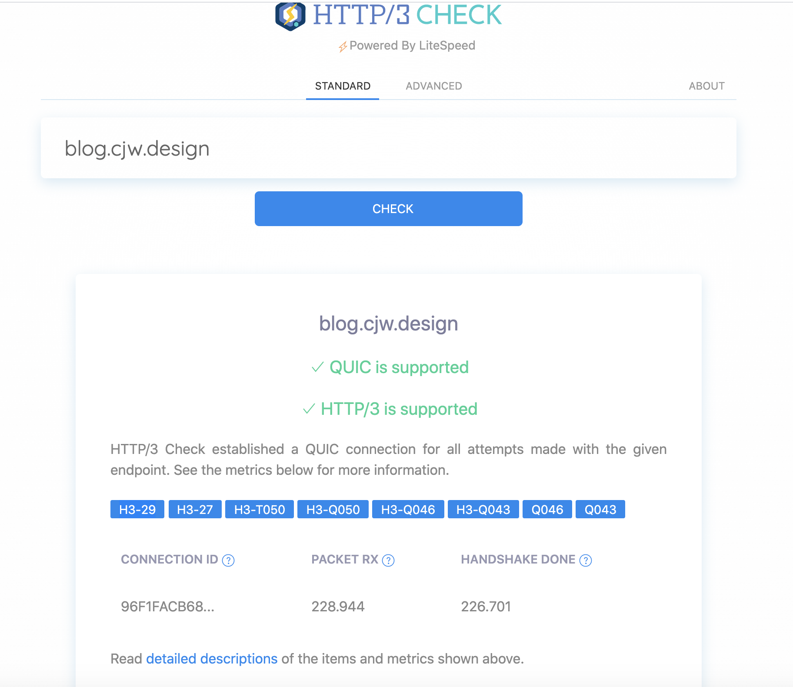
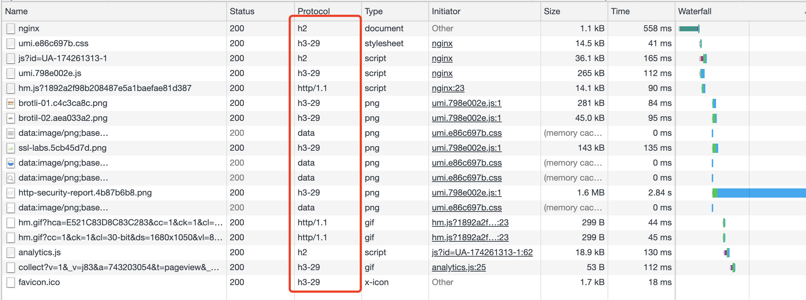

# HTTP/3 Quic 协议实践


**不会吧 不会吧，都 2020 年了，还有网站不支持 `http/3` 的?**

# 本站已正式支持 HTTP/3 Quic 协议

## 前置知识简介

`QUIC` 是 `Quick UDP Internet Connections` 的缩写，谷歌发明的新传输协议, `QUIC` 建立在 `UDP` 之上

`QUIC` 与现有 `TCP` + `TLS` + `HTTP/2` 方案相比，有以下几点主要特征：

- 利用缓存，显著减少连接建立时间
- 改善拥塞控制，拥塞控制从内核空间到用户空间
- 没有 `head of line` 阻塞的多路复用
- 前向纠错，减少重传
- 连接平滑迁移，网络状态的变更不会影响连接断线。

## 开启 HTTP/3 实践

本站使用的 `nginx` 是用 `docke` 启动的 `nginx` 镜像，`nginx` 原生模块不支持 `http3`， 要添加额外的 `http3` 模块，重新编译 `nginx`, 我这里直接使用现成的支持 `http3` 的 `nginx-http3` 镜像, [查看镜像地址](https://hub.docker.com/r/ranadeeppolavarapu/nginx-http3)

1. **修改 docker 配置**  
   我这里使用的 `docker-compose` 管理镜像, 只需要修改 `docker-compose.yml` 即可, 修改后的配置如下

   ```yaml
   version: '3.2'
   services:
   nginx:
     image: ranadeeppolavarapu/nginx-http3
     container_name: nginx
     restart: always
     ports:
       - 80:80
       - 443:443
       - 443:443/udp # 开放 443 udp端口
     volumes:
       - ./run/conf/conf.d:/etc/nginx/conf.d/
       - ./run/log:/var/log/nginx
       - ./run/html:/usr/share/nginx/html:ro
       - ./run/cert:/etc/nginx/cert
       - ./run/conf/nginx.conf:/etc/nginx/nginx.conf
       - /etc/localtime:/etc/localtime
   ```

   > Tips: 这里一定需要主要映射容器的 `443/udp` 端口

2. **修改 nginx 配置**  
   监听 `443` 端口, 添加返回头信息 `alt-svc`, 指定 `http/3`版本等信息

   ```nginx
   server {
       # 启用 QUIC and HTTP/3.
       listen 443 quic reuseport;
       # 启用 HTTP/2.
       listen 443 ssl http2;
       server_name blog.cjw.design;

       access_log  /var/log/nginx/last/blog.cjw.design.access.log  main;
       error_log   /var/log/nginx/last/blog.cjw.design.error.log   warn;

       root /usr/share/nginx/html;

       include inc/ssl.conf;
       include inc/safe.conf;
       include inc/HSTS.conf;
       include inc/expires.conf;
       include inc/robots.conf;

       # 需要配置 TLS1.3, ssl 相关配置 我都放在了 inc/ssl.conf 中，这里为了单独展示提出来了
       ssl_protocols    TLSv1.2 TLSv1.3; # QUIC requires TLS 1.3

       # 添加 alt-svc 返回头， 这里使用 google 默认的返回头信息
       add_header alt-svc 'h3-29=":443"; ma=2592000,h3-27=":443"; ma=2592000,h3-T050=":443"; ma=2592000,h3-Q050=":443"; ma=2592000,h3-Q046=":443"; ma=2592000,h3-Q043=":443"; ma=2592000,quic=":443"; ma=2592000; v="46,43"';
   ```


        location / {
            index  index.html;
            try_files $uri /index.html;
        }

    }
    ```

> Tips：
>
> 1. 有多个站点时 `reuseport` 参数只需要添加一次, 否则 `nginx` 会报错.
> 2. 一定要开启 `TLS1.3`

3. **开放云服务器安全组 `443/udp` 端口**
   这个算是一个坑，云服务器一般 不会开放 `443/udp`端口，需要手动开放

现在重启 `docker-compose` 即可， 可以在 <https://http3check.net/> 检测网站是否 支持 `http/3`, 本站测试结果如下

[](https://http3check.net/?host=blog.cjw.design)

4. **测试 http/3 请求**
   建议下载 `Google Chrome Canary` 浏览器， [下载地址](https://www.google.com/intl/zh-CN/chrome/canary/), 可以支持配置很多实验型参数, 我这里下载的是 `Mac` 版本的 Google Chrome `86.0.4228.0` (正式版本) canary (x86_64), 对应 `quic` 版本 `h3-29`

   添加启动配置参数， 分两种情况

   - `Window` ：  
      右键 `Google Chrome Canary` 快捷方式  
      点击`属性`, 弹出程序属性面板  
      切换到 `快捷方式` Tab
     修改 `目标` 链接内容， (原始内容类似 `"C:\User\my\AppData\Local\Google\Chrome SxS\Application\chrome.exe"`)
     在链接最后空一格添加 `--enable-quic --quic-version=h3-29`配置参数

     > Tips: 如果链接后面有引号 `"`, 参数放在引号之后，没有引号直接放最后即可

   - `Mac`：  
      Mac 修改程序的启动参数有两种方法

     **方法 1:**  
      首先找到 `Google Chrome Canary`的包位置 , 默认位置 在 `/Applications/Google Chrome Canary.app/Contents/MacOS`  
      该目录下包含一个程序包 `Google Chrome Canary`, 我们需要做的就是创建一个脚本，然后用脚本启动这个包，并添加启动参数

     > Tips: 坑！ 经实践，这样配置的脚本一开始是 ok 的，但后续不知道因为什么原因，脚本会失效，启动不了，需要重新执行一遍流程 才可以恢复，不建议使用这种方式， 建议使用 `方法2`

     - 进入对应文件夹
       ```bash
       cd "/Applications/Google Chrome Canary.app/Contents/MacOS"
       ```
     - 修改原始包名称，因为脚本会替代当前包名称
       ```bash
       sudo mv "Google Chrome Canary" Google.Canary.Real
       ```
     - 新建脚本 `Google Chrome Canary`
       ```bash
       vim "Google Chrome Canary"
       ```
     - 添加脚本内容, 脚本就是参数启动原始程序
       ```bash
       #!/bin/bash
       cd "/Applications/Google Chrome Canary.app/Contents/MacOS"
       "/Applications/Google Chrome Canary.app/Contents/MacOS/Google.Canary.Real" --args --disable-web-security --user-data-dir --enable-quic --quic-version=h3-29
       ```

     **方法 2:**  
      直接使用 `Terminal` 命令启动

     ```bash
     open "/Applications/Google Chrome Canary.app" --args --enable-quic --quic-version=h3-29
     ```

     如果希望可以双击启动，可以在桌面创建一个 `.command` 后缀的命令脚本文件

     ```bash
     vim "Google Chrome Canary.command"
     ```

     写入上面的 bash 命令

     ```bash
      #!/bin/sh
      open "/Applications/Google Chrome Canary.app" --args --disable-web-security --user-data-dir --enable-quic --quic-version=h3-29
     ```

     这样就可以双击带参数的启动 `Chrome Canary` 了，如果有需要其他的参数也可以很方便添加

应用配置，重启浏览器即可，如果有问题 浏览器搜索 `chrome://flags/`, 搜索 `Experimental QUIC protocol`, 选择 `Enabled`选项重启即可, 打开浏览器 跳转 <https://blog.cjw.design/blog/devopts/http3>，打开控制台看到 查看 `network`, 可以查看所有资源的请求详情，类似内容如下
[](https://blog.cjw.design/blog/devopts/http3)， 此时可以查看到很多资源使用的 `h3-29` 协议请求内容

> Tips： 如果没有 `Protocol` 选项右键 `Status` 表头栏，选择添加 `Protocol`即可

## 总结

以上就是我将本站 添加 `http/3` 支持的全部历程，关于 `http/3` 的其他详细介绍，可以查看其他资料，这里是为了方便快速的给自己站点配置 `http/3` 的教程
