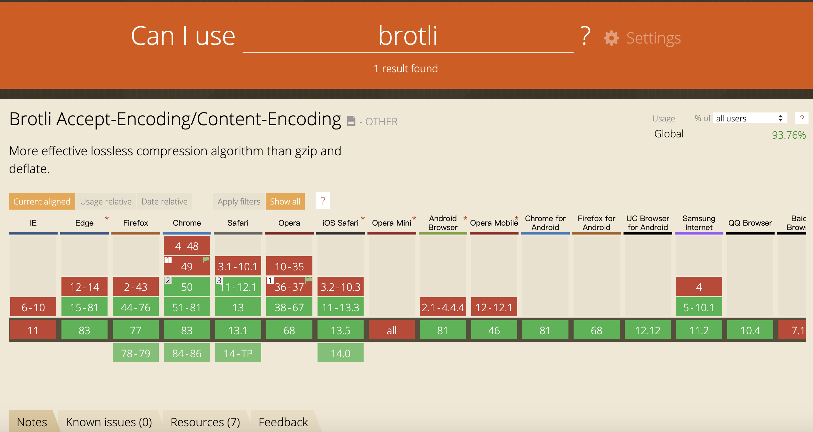
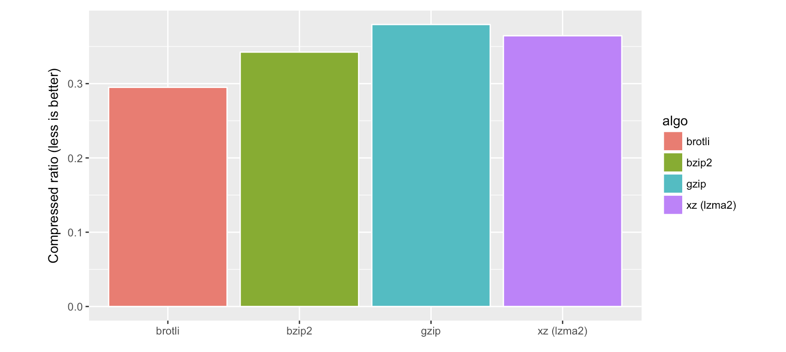
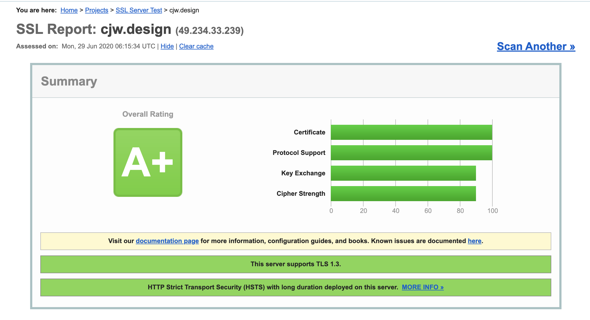
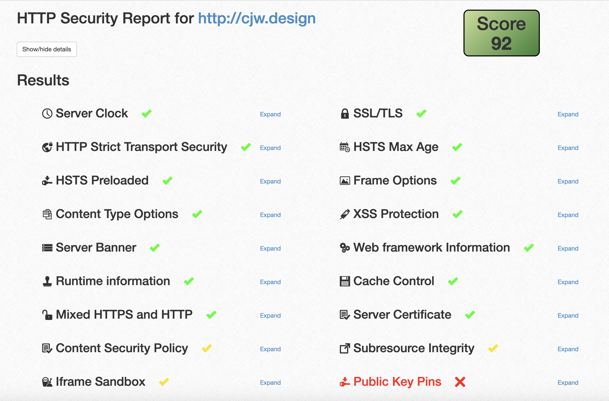

---
group:
  title: 运维
  order: 4
---

# Nginx 配置详解

## Nginx 简介

`Nginx (engine x)`是一个高性能的 HTTP 和反向代理 web 服务器，同时也提供`IMAP/POP3/SMTP`服务。它的特点是：占用内存小，并发能力强。
Nginx 可以作为静态的 web 服务器，同时支持`CGI协议`的动态语言，比如`perl`，`php`。而 JavaWeb 项目则需要与`tomcat`配合完成。Nginx 专门为了优化而开发，性能是最重要的考量。

Nginx 支持`热部署`。可以在不间断服务的情况下，对软件版本进行升级。

## Nginx 目录建议

推荐使用配置和程序分离的方式，遵循：

- 配置文件独立管理, 不存放在 nginx 程序目录内
- 每个站点独立一个配置文件
- 每个站点独立的日志文件
- 提取公用的配置文件

最终配置文件目录结构如下

```
$dir/wwwroot/                           - 网站根目录，以域名为文件夹名称
    ./blog.cjw.design/
    ./api.cjw.design/
    ./www.cjw.design/

$dir/nginx/                             - nginx相关根目录
    ./conf/                             - 配置文件
        ./nginx.conf                    - 配置主入口
        ./inc                           - 通用配置
        ./vhost/                        - 各站点的配置，以 `域名.conf` 命名
            ./xuexb.com.conf
            ./static.xuexb.com.conf

    ./1.11.1/                           - 各个版本的nginx
    ./1.11.2/

$dir/nginx/
    ./logs/                           - 日志相关目录，内以 `域名.type.log` 命名
        ./last/                         - 最新的日志
            ./blog.cjw.design.error.log
            ./blog.cjw.design.access.log
            ./api.cjw.design.error.log
            ./api.cjw.design.access.log
            ./www.cjw.design.error.log
            ./www.cjw.design.access.log
        ./back/                         - 天级备份日志
            ./20170908/
                ./blog.cjw.design.error.log
                ./blog.cjw.design.access.log
                ./api.cjw.design.error.log
                ./api.cjw.design.access.log
                ./www.cjw.design.error.log
                ./www.cjw.design.access.log
```

这样分离之后不管是 Nginx 主程序版本升级，还是修改某个站点配置，还是快速查找某个站点日志都是得心应手~

## Nginx 安装

我一般图省事，直接使用 `docker` 安装 `nginx`, `docker-compose` 管理配置`nginx`配置，这样在不同系统环境下，安装方式和配置文件都较为统一, 步骤如下
环境 Linux Centos

- 安装 `docker`:
  ```bash
  sudo yum install docker-ce docker-ce-cli containerd.io
  ```
- 安装 `docker-compose`:
  ```bash
  curl -L https://github.com/docker/compose/releases/download/1.26.0/docker-compose-`uname -s`-`uname -m` -o /usr/local/bin/docker-compose
  # 添加文件执行权限
  chmod +x /usr/local/bin/docker-compose
  ```
- 拉取 `nginx` 镜像

  ```bash
  docker pull nginx
  ```

- 编写 `docker-compose.yml`:

  ```yaml
  version: '3.2'
  services:
    nginx:
      image: nginx
      container_name: nginx
      restart: always
      ports:
        # 开放80 443端口，其他端口可以另外配置
        - 80:80
        - 443:443
      volumes:
        # 将nginx需要自定义配置的目录或者文件， volume映射到本地目录，方便修改
        - ./run/conf/conf.d:/etc/nginx/conf.d/
        - ./run/log:/var/log/nginx
        - ./run/conf/nginx.conf:/etc/nginx/nginx.conf
  ```

- 配置 `nginx.conf` 主入口配置：
  默认配置如下，

  ```nginx
  # /run/conf/nginx.conf
  user  nginx;
  worker_processes  1;

  error_log  /var/log/nginx/error.log warn;
  pid        /var/run/nginx.pid;

  events {
      worker_connections  1024;
  }

  http {
      include       /etc/nginx/mime.types;
      default_type  application/octet-stream;

      log_format  main  '$remote_addr - $remote_user [$time_local] "$request" '
                        '$status $body_bytes_sent "$http_referer" '
                        '"$http_user_agent" "$http_x_forwarded_for"';

      access_log  /var/log/nginx/access.log  main;

      sendfile        on;
      #tcp_nopush     on;

      keepalive_timeout  65;

      #gzip  on;

      include /etc/nginx/conf.d/*.conf;
  }

  ```

  > Tips: 可以进入 `docker` 容器直接复制 nginx 的 默认配置

- 添加一个 默认业务配置 `default.conf`:

  ```nginx
  # /run/conf/conf.d/default.conf
  server {
      listen       80;
      server_name  localhost;

      #charset koi8-r;
      #access_log  /var/log/nginx/host.access.log  main;

      location / {
          root   /usr/share/nginx/html;
          index  index.html index.htm;
      }

      #error_page  404              /404.html;

      # redirect server error pages to the static page /50x.html
      #
      error_page   500 502 503 504  /50x.html;
      location = /50x.html {
          root   /usr/share/nginx/html;
      }

      # proxy the PHP scripts to Apache listening on 127.0.0.1:80
      #
      #location ~ \.php$ {
      #    proxy_pass   http://127.0.0.1;
      #}

      # pass the PHP scripts to FastCGI server listening on 127.0.0.1:9000
      #
      #location ~ \.php$ {
      #    root           html;
      #    fastcgi_pass   127.0.0.1:9000;
      #    fastcgi_index  index.php;
      #    fastcgi_param  SCRIPT_FILENAME  /scripts$fastcgi_script_name;
      #    include        fastcgi_params;
      #}

      # deny access to .htaccess files, if Apache's document root
      # concurs with nginx's one
      #
      #location ~ /\.ht {
      #    deny  all;
      #}
  }

  ```

  > Tips: 可以进入 `docker` 容器直接复制 nginx 的 默认配置

- 启动 `nginx`:
  ```bash
  docker-compose up -d
  ```
  此时访问 `curl http://localhost:80` 端口，可以访问到默认的 `nginx` 首页

## Nginx 配置文件结构详解

Nginx 配置文件主要由三大块构成：`全局块`，`events块`，`http块`。其中，`http块`为核心，具体又可细分为 `server快` `location快`等。

```
main # 全局配置，对全局生效
├── events # 配置影响 Nginx 服务器或与用户的网络连接
├── http # 配置代理，缓存，日志定义等绝大多数功能和第三方模块的配置
│ ├── upstream # 配置后端服务器具体地址，负载均衡配置不可或缺的部分
│ ├── server # 配置虚拟主机的相关参数，一个 http 块中可以有多个 server 块
│ ├── server
│ │ ├── location # server 块可以包含多个 location 块，location 指令用于匹配 uri
│ │ ├── location
│ │ └── ...
│ └── ...
└── ...
```

- `全局快`：
  作用域为文件开始到`events块`之前的部分。这里的配置会影响到 nginx 服务器整体的运行。

  其中，`work_process` 表示可并发处理的请求数量。这个配置取决于机器实际的硬件/软件配置。一般跟 cpu 核数相同或为它的倍数。

- `events块`：
  这里的配置会影响到 Nginx 服务器和用户的网络连接。
  其中，`worker_connections` 表示每个进程允许的最多连接数，它会影响到 Nginx 的总体性能，所以应当灵活配置。 理论上每台 nginx 服务器的最大连接数为`worker_processes` \* `worker_connections`。

  **worker_connections 解析：**

  1. connections 不是随便设置的，而是与两个指标有重要关联，一是内存，二是操作系统级别的“进程最大可打开文件数”。
  2. 内存：每个连接数分别对应一个`read_event`、一个`write_event`事件，一个连接数大概占用 232 字节，2 个事件总占用 96 字节，那么一个连接总共占用 328 字节，通过数学公式可以算出 100000 个连接数大概会占用 31M = 100000 \* 328 / 1024 / 1024，当然这只是 nginx 启动时，nginx `connections连接数`所占用的内存。
  3. 进程最大可打开文件数：进程最大可打开文件数受限于操作系统，可通过 `ulimit -n` 命令查询，以前是 1024，现在是 65535,
     nginx 提供了`worker_rlimit_nofile`指令，这是除了 ulimit 的一种设置可用的描述符的方式。 该指令与使用`ulimit`对用户的设置是同样的效果。此指令的值将覆盖 ulimit 的值，如：`worker_rlimit_nofile 20960`;  
     设置 ulimits：`ulimit -SHn 65535`

- `http块`：
  这一块是配置的主要内容，http 块还包含了两部分：`http全局块`，`server块`。其中 nginx 默认将`server块`单独迁移到了另外一个配置文件`conf.d/default.conf`中。

- `server块`：
  每个`server块`都相当于是一个虚拟主机。而每个`server块`又分为`全局server块`，和一个（或者多个）`location块`
  下面代表其中一个虚拟主机：启动在本地，并开启 80 端口。
  ```nginx
  listen        80;
  server_name   localhost;
  ```
- `location块` ：
  `location块`配置了在当前 `server块` 虚拟主机下生效的 请求 url 和资源的映射

## Nginx 常用内置全局变量

- **服务器相关**

  | 变量名             | 结果                       | 备注                                                                                      |
  | ------------------ | -------------------------- | ----------------------------------------------------------------------------------------- |
  | `$nginx_version`   | 1.11.2                     | 当前运行的 nginx 版本号                                                                   |
  | `$server_port`     | 8001                       | 服务器端口                                                                                |
  | `$server_addr`     | 127.0.0.1                  | 服务器端地址，需要注意的是：为了避免访问 linux 系统内核，应将 ip 地址提前设置在配置文件中 |
  | `$server_protocol` | HTTP/2.0                   | 服务器的 HTTP 版本, 通常为 “HTTP/1.0” “HTTP/1.1” 或 “HTTP/2.0”                            |
  | `$document_root`   | /usr/share/html/cjw.design | 当前请求的文档根目录或别名                                                                |
  | `$pid`             | 6558                       | 工作进程的 PID                                                                            |
  | `$realpath_root`   | /usr/share/html/cjw.design | 当前请求的文档根目录或别名的真实路径，会将所有符号连接转换为真实路径                      |

- **客户端相关**  
  变量名 | 结果 | 备注
  -------- | ---- | ---
  `$host` | cjw.design | HTTP 请求行的主机名>”HOST”请求头字段>符合请求的服务器名
  `$hostname` | bj01 | 主机名
  `$remote_port` | 51172 | 客户端端口
  `$request` | GET /api/dump/path?a=1&%E4%B8%AD%E6%96%87=%E5%A5%BD%E7%9A%84 HTTP/1.0 | 代表客户端的请求地址
  `$request_body` | 1.11.2 | 客户端的请求主体, 此变量可在 location 中使用，将请求主体通过 proxy*pass
  `$proxy_protocol_addr` | | 获取代理访问服务器的客户端地址，如果是直接访问，该值为空字符串(1.5.12)
  `\$http*名称`| http_accept_language -> zh-CN,zh;q=0.9 | 匹配任意请求头字段； 变量名中的后半部分`名称`可以替换成任意请求头字段，如在配置文件中需要获取http请求头：“Accept-Language”，那么将“－”替换为下划线，大写字母替换为小写，形如：http_accept_language即可`\$bytes_sent`| 0 | 传输给客户端的字节数 (1.3.8, 1.2.5)`\$body_bytes_sent` | 0 | 传输给客户端的字节数，响应头不计算在内；这个变量和 Apache 的 mod_log_config 模块中的“%B”参数保持兼容

* **链接相关**  
  变量名 | 结果 | 备注
  -------- | ---- | ---
  `$scheme` | https | 请求使用的 Web 协议, “http” 或 “https”
  `$uri` | /api/dump/path | 请求中的当前 URI(不带请求参数，参数位于 args)，可以不同于浏览器传递的 request*uri 的值，它可以通过内部重定向，或者使用 index 指令进行修改，/api/dump/path 不包含主机名，如”/foo/bar.html”
  `$document_uri` | /api/dump/path | 同 uri
  `$request_uri` | /api/dump/path?a=1&%E4%B8%AD%E6%96%87=%E5%A5%BD%E7%9A%84 | 这个变量等于包含一些客户端请求参数的原始 URI，它无法修改，请查看/api/dump/path 更改或重写 URI，不包含主机名，例如：”/cnphp/test.php?arg=freemouse”
  `$request_method` | GET | HTTP 请求方法，通常为“GET”或“POST”
  `$request_time` | 0.000 | 处理客户端请求使用的时间 (1.3.9, 1.2.6); 从读取客户端的第一个字节开始计时
  `$request_length` | 667 | 请求的长度 (包括请求的地址, http 请求头和请求主体) (1.3.12, 1.2.7)
  `$args` | a=1&%E4%B8%AD%E6%96%87=%E5%A5%BD%E7%9A%84 | 请求中的参数值
  `\$arg*参数名`| arg_a => 1 | 请求中的的参数名，即“?”后面的arg_name=arg_value形式的arg_name`\$query_string`| a=1&%E4%B8%AD%E6%96%87=%E5%A5%BD%E7%9A%84 | 同 args`\$is_args`| ? | 如果请求中有参数，值为“?”，否则为空字符串`\$https` | on | 如果开启了 SSL 安全模式，值为“on”，否则为空字符串

## Location 配置前缀指令

location 匹配指令包含以下形式：

```nginx
location [ = | ~ | ~* | ^~ | !~ | !~* ] /uri/ {
	....
}
```

- `=` : 精确匹配, 用于不含正则表达式的 uri 前，如果匹配成功，不再进行后续的查找

  ```nginx
  # https://api.cjw.design/api/check => http:127.0.0.1:9998/api/check
  # https://api.cjw.design/api/check/cc => 不匹配
  location = /api/check {
    proxy_pass http:127.0.0.1:9998/api/
  }
  ```

  只匹配请求路径为 `/api/check` 时， 才匹配

- `^~`: 用于不含正则表达式的 uri 前，表示如果该符号后面的字符是最佳匹配，采用该规则，不再进行后续的查找；

  ```nginx
  # https://api.cjw.design/api/check => http:127.0.0.1:9998/api/check
  # https://api.cjw.design/api/status => http:127.0.0.1:9998/api/status
  # https://api.cjw.design/api-x/check => 不匹配
  location ^~ /api/ {
    proxy_pass http:127.0.0.1:9998/api/
  }
  ```

- `~` 表示用该符号后面的正则去匹配路径，区分大小写；

  ```nginx
  location ~ \d{1,3}\.webp$ {
    # https://api.cjw.design/static/123.webp => http:127.0.0.1:9998/static/123.webp
    # https://api.cjw.design/static/123.WEBP => http:127.0.0.1:9998/static/123.WEBP

    proxy_pass http:127.0.0.1:9998

    # 错误， 不能包含 /
    # proxy_pass http:127.0.0.1:9998/
    # 错误， 不能包含 /static
    # proxy_pass http:127.0.0.1:9998/static
  }
  ```

  > Tips: 在进行正则匹配（`~`和`~*`）时，配置的`proxy_pass`不允许包含`uri`

- `~*` 表示用该符号后面的正则去匹配路径，不区分大小写；

  ```nginx
  location ~* \d{1,3}\.webp$ {
    # https://api.cjw.design/static/123.webp => http:127.0.0.1:9998/static/123.webp
    # https://api.cjw.design/static/123.WEBP => http:127.0.0.1:9998/static/123.webp

    proxy_pass http:127.0.0.1:9998

    # 错误， 不能包含 /
    # proxy_pass http:127.0.0.1:9998/
    # 错误， 不能包含 /static
    # proxy_pass http:127.0.0.1:9998/static
  }
  ```

  > Tips: 在进行正则匹配（`~`和`~*`）时，配置的`proxy_pass`不允许包含`uri`

- `!~`： 表示区分大小写不匹配的正则

  ```nginx
  location !~ ^/test/.*\.mp4$ {
    # https://api.cjw.design/test/123.mp4 => 不匹配
    # https://api.cjw.design/test/123.MP4 => http:127.0.0.1:9998/test/123.MP4
    # https://api.cjw.design/static/123.MP4 => http:127.0.0.1:9998/static/123.MP4

    proxy_pass http:127.0.0.1:9998

    # 错误， 不能包含 /
    # proxy_pass http:127.0.0.1:9998/
    # 错误， 不能包含 /static
    # proxy_pass http:127.0.0.1:9998/static
  }
  ```

  > Tips: 在进行正则匹配（`~`和`~*`）时，配置的`proxy_pass`不允许包含`uri`

- `!~*`： 表示区分大小写不匹配的正则

  ```nginx
  location !~* ^/test/.*\.mp4$ {
    # https://api.cjw.design/test/123.mp4 => 不匹配
    # https://api.cjw.design/test/123.MP4 => 不匹配
    # https://api.cjw.design/static/123.MP4 => http:127.0.0.1:9998/static/123.mp4

    proxy_pass http:127.0.0.1:9998

    # 错误， 不能包含 /
    # proxy_pass http:127.0.0.1:9998/
    # 错误， 不能包含 /static
    # proxy_pass http:127.0.0.1:9998/static
  }
  ```

  > Tips: 在进行正则匹配（`~`和`~*`）时，配置的`proxy_pass`不允许包含`uri`

## Location 前缀指令匹配顺序

1. 优先精确匹配，查找是否匹配 `=` 规则，如果匹配成功，不再进行后续的查找；
2. 然后前缀匹配，查找是否匹配 `^~`前缀，如果该符号后面的字符是最佳匹配，采用该规则，不再进行后续的查找.
   > Tips: 前缀匹配，如果有包含关系时，按最大匹配原则进行匹配。比如在前缀匹配：`location /dir01` 与 `location /dir01/dir02`，如有请求 `http://localhost/dir01/dir02/file` 将最终匹配到 `location /dir01/dir02`
3. 其次是按文件中顺序的正则匹配 `~ | ~*`，该符号只会匹配第一个符合正则匹配的规则，不再进行后续查找
4. 然后匹配不带任何修饰的前缀路径匹配, `location /uri`, 也表示前缀匹配, 但是在正则匹配之后，如果没有正则命中，命中最长的规则。
5. 如果上面的匹配都没有命中，最后是交给 `/` 通用匹配

## Nginx 配置状态码，错误文件

```nginx
server {
    root   /usr/share/nginx/html;
    # http status 为 404时, 返回 404.html
    error_page 404 /404.html;

    # http status 为 500或者502, 返回 50x.html
    error_page   500 502  /50x.html;

    # http status 为 503, 返回 50x.html， 且返回错误码改为 200
    error_page   503 = 200  /50x.html;

    # http status 为 504, 重定向到 https://cjw.design，http code 码改为 301
    error_page   504 = 301  https://cjw.design;
}
```

> Tips: `error_page` 配置时加 `=` 和不加 `=` 的区别，加了 `=` 表示响应为指定的 `http status code` ，默认为 `200`，不加 `=` 为原错误的状态码

## Nginx 配置二级域名

> Tips： 需要线在某某云配置二级域名， 配置二级域名一般在某某云平台 `域名管理 -> 解析 -> 添加记录` 中添加二级域名，并解析到我们配置的服务器 ip 上即可。以 `blog.cjw.design` 为例

```nginx
sever {
    listen 80;
    server_name blog.cjw.design;
    location / {
      root /usr/share/nginx/html/blog;
      index index.html;
    }
}
```

## Nginx 配置反向代理

nginx 可以将请求转发到其他地址上。例如将二级域名 `api.cjw.design` 转发到本地端口 `127.0.0.1:8001`

```nginx
server {
    listen 80;
    server_name api.cjw.design;
    location / {
      proxy_pass http://127.0.0.1:8001/;
    }
}
```

反向代理还有一些其他的指令，可以了解一下：

1. `proxy_set_header`：在将客户端请求发送给后端服务器之前，更改来自客户端的请求头信息；
2. `proxy_connect_timeout`：配置 Nginx 与后端代理服务器尝试建立连接的超时时间；
3. `proxy_read_timeout`：配置 Nginx 向后端服务器组发出 read 请求后，等待相应的超时时间；
4. `proxy_send_timeout`：配置 Nginx 向后端服务器组发出 write 请求后，等待相应的超时时间；
5. `proxy_redirect`：用于修改后端服务器返回的响应头中的 Location 和 Refresh。

## Nginx 重定向

- **http 重定向 https**:
  ```nginx
  server {
    listen       80;
    server_name  cjw.design www.cjw.design;
    location / {
       # 判断schema是不是https，如果不是则直接301重定向，permanent表示301
       if ( $schema != 'https' ) {
          rewrite ^(.*)$ https://$host$1 permanent;
       }
    }
  }
  ```
- **移动端和电脑端双向跳转**

  ```nginx
  server {
    listen       80;
    server_name  cjw.design www.cjw.design;
    location / {
       # 判断http_user_agent是不是移动端，如果不是则直接301重定向，permanent表示301
       if ($http_user_agent ~* (mobile|nokia|iphone|ipad|android|samsung|htc|blackberry)) {
         rewrite  ^(.*)    http://m.cjw.design$1 permanent;
       }
    }
  }

  server {
    listen       80;
    server_name  m.cjw.design;
    location / {
       # 判断http_user_agent是不是移动端，如果不是则直接301重定向，permanent表示301
       if ($http_user_agent !~* (mobile|nokia|iphone|ipad|android|samsung|htc|blackberry)) {
         rewrite  ^(.*)    http://www.cjw.design$1 permanent;
       }
    }
  }
  ```

- **主域 301 重定向**  
  你的网站可能有多个域名访问，比如：`www.cjw.design`、`cjw.design` 等，设置主域意思是不管用户输入哪个域名，都会 301 重定向到主域上，设置主域可以对 `SEO` 更友好, 比如 以 `cjw.design` 为主域名
  ```
  www.cjw.design => cjw.design
  www.cjw.design/list/111 => cjw.design/list/111
  ```
  配置如下：
  ```nginx
  server {
    listen 80;
    server_name  www.cjw.design cjw.design;
    location / {
        if ( $host = 'www.cjw.design' ) {
          rewrite  ^(.*)    http://cjw.design$1 permanent;
        }
    }
  }
  ```

## Nginx 跨域 设置

现在前后端分离的项目一统天下，经常本地起了前端服务，需要访问不同的后端地址，不可避免遇到跨域问题，nginx 解决跨域的方式主要有两种

- **使用 Nginx 反向代理解决跨域**  
  在前端服务地址为 `blog.cjw.design` 的页面请求 `api.cjw.design` 的后端服务导致的跨域，可以配置反向代理

  ```nginx
  server {
    listen 80;
    server_name blog.cjw.design;

    location /api/ {
      proxy_set_header Connection "";
      proxy_set_header X-Real-IP $remote_addr;
      proxy_set_header X-Forwarded-For $proxy_add_x_forwarded_for;
      proxy_set_header Host $http_host;
      proxy_set_header X-NginX-Proxy true;
      proxy_pass http://api.cjw.design/;
    }
  }
  ```

  这样就将对前一个域名 `blog.cjw.design/api` 的请求全都代理到了 `api.cjw.design`绕过了跨域。

- **添加 CORS 跨域 header 配置**  
  当浏览器在访问跨源的服务器时，也可以在跨域的服务器上直接设置 Nginx，从而前端就可以无感地开发，不用把实际上访问后端的地址改成前端服务的地址，这样可适性更高

  ```nginx
  server {
    listen 80;
    server_name api.cjw.design;

    add_header 'Access-Control-Allow-Origin' $http_origin;   # 全局变量获得当前请求origin，带cookie的请求不支持*
    add_header 'Access-Control-Allow-Credentials' 'true';    # 为 true 可带上 cookie
    add_header 'Access-Control-Allow-Methods' 'GET, POST, OPTIONS';  # 允许请求方法, 也可以为 *
    add_header 'Access-Control-Allow-Headers' $http_access_control_request_headers;  # 允许请求的 header，可以为 *
    add_header 'Access-Control-Expose-Headers' 'Content-Length,Content-Range'; # 列出了哪些首部可以作为响应的一部分暴露给外部。

    if ($request_method = 'OPTIONS') {
      add_header 'Access-Control-Max-Age' 1728000;   # OPTIONS 请求的有效期，在有效期内不用发出另一条预检请求
      add_header 'Content-Type' 'text/plain; charset=utf-8';
      add_header 'Content-Length' 0;
      return 204;                  # 200 也可以
    }

    location / {
      proxy_pass http://127.0.0.1:8001/;
    }
  }
  ```

## Nginx 配置 gzip 压缩

使用 `gzip` 不仅需要 Nginx 配置，浏览器端也需要配合，需要在请求消息头中包含 `Accept-Encoding: gzip`（`IE5` 之后所有的浏览器都支持了，是现代浏览器的默认设置）。一般在请求 html 和 css 等静态资源的时候，支持的浏览器在 request 请求静态资源的时候，会加上 `Accept-Encoding: gzip` 这个 header，表示自己支持 gzip 的压缩方式，Nginx 在拿到这个请求的时候，如果有相应配置，就会返回经过 gzip 压缩过的文件给浏览器，并在 response 相应的时候加上 `content-encoding: gzip` 来告诉浏览器自己采用的压缩方式（因为浏览器在传给服务器的时候一般还告诉服务器自己支持好几种压缩方式），浏览器拿到压缩的文件后，根据自己的解压方式进行解析。

我们在上线前，代码（JS、CSS 和 HTML）会做压缩，图片也会做压缩（PNGOUT、Pngcrush、JpegOptim、Gifsicle 等）。对于文本文件，在服务端发送响应之前进行 GZip 压缩也很重要，通常压缩后的文本大小会减小到原来的 1/4 - 1/3

```nginx
http {
  # gzip 基础配置只需要前面两条
  gzip               on;
  gzip_types         text/plain text/css application/json application/x-javascript text/xml application/xml application/xml+rss text/javascript application/javascript;

  # gzip 更多细节配置
  gzip_vary          on;
  gzip_static        on; # on | off | always;
  gzip_comp_level    6;
  gzip_buffers       16 8k;
  gzip_min_length    1000;
  gzip_proxied       any;
  gzip_disable       "msie6";
  gzip_http_version  1.0;
}
```

gzip 配置属性介绍:

1. `gzip_types`：要采用 gzip 压缩的 `MIME` 文件类型，其中 `text/html` 被系统强制启用；

2. `gzip_vary`：用于在响应消息头中添加 `Vary：Accept-Encoding`，使代理服务器根据请求头中的 `Accept-Encoding` 识别是否启用 gzip 压缩；
3. `gzip_static`：默认 `off`，该模块启用后，Nginx 首先检查是否存在请求静态文件的 `gz` 结尾的文件，如果有则直接返回该 `.gz` 文件内容；
4. `gzip_comp_level`：gzip 压缩比，压缩级别是 `1-9`，`1` 压缩级别最低，`9` 最高，级别越高压缩率越大，压缩时间越长，建议 `4-6`；
5. `gzip_buffers`：获取多少内存用于缓存压缩结果，`16 8k` 表示以 `8k*16` 为单位获得；
6. `gzip_min_length`：允许压缩的页面最小字节数，页面字节数从 header 头中的 `Content-Length` 中进行获取。默认值是 `0`，不管页面多大都压缩。建议设置成大于 `1k` 的字节数，小于 `1k` 可能会越压越大；
7. `gzip_proxied`：默认 `off`，nginx 做为反向代理时启用，用于设置启用或禁用从代理服务器上收到相应内容 gzip 压缩；
8. `gzip_disable`：指令接受一个正则表达式，当请求头中的 `UserAgent`字段满足这个正则时，响应不会启用 GZip，这是为了解决在某些浏览器启用 GZip 带来的问题。特别地，指令值 `msie6` 等价于 `MSIE [4-6]\.`，但性能更好一些。另外，`Nginx 0.8.11` 后，`msie6` 并不会匹配 UA 包含 `SV1` 的 `IE6`（例如 `Windows XP SP2` 上的 `IE6`），因为这个版本的 `IE6` 已经修复了关于`GZip` 的若干 Bug
9. `gzip_http_version`：默认 `1.1`，启用 gzip 所需的 HTTP 最低版本 为 `1.0`；

## Nginx 配置 brotli 压缩

2015 年 9 月 Google 推出了无损压缩算法 `Brotli`。`Brotli` 通过变种的 `LZ77 算法`、`Huffman 编码`以及`二阶文本建模`等方式进行数据压缩，与其他压缩算法相比，它有着更高的压塑压缩效率。

**浏览器支持度情况**
[](https://www.caniuse.com/#search=brotli)

**压缩性能情况**
[](https://cran.r-project.org/web/packages/brotli/vignettes/benchmarks.html)

Brotli 的压缩率更高，意味着通过 Brotli 算法压缩的文件，文件大小更小，但是 Brotli 的压缩时间比 gzip 要多，而解压时间则相当。所以在运行中（on-the-fly）使用 Brotli 算法压缩文件可能并不是一个很好的方案

其他性能对比可以 [查看这里](https://cran.r-project.org/web/packages/brotli/vignettes/benchmarks.html)

**使用 Brotli**
nginx 默认 没有 `brotli` 功能, 需要额外安装 `ngx_brotli` 模块, 我这里为了方便，直接使用已经包含了`brotli` 功能的 docker 镜像 [fholzer/nginx-brotli](https://hub.docker.com/r/fholzer/nginx-brotli)

另外，由于不是所有浏览器都支持 Brotli 算法，所以在服务端，我们需要同时提供两种文件，一个是经过 Brotli 压缩的文件，一个是原始文件，在浏览器不支持 Brotli 的情况下，我们可以使用 gzip 去压缩原始文件提供给客户端。

然后添加对应的配置

```nginx
http {
    brotli             on;
    brotli_static       on; # on | off | always;
    brotli_comp_level  6;
    # brotli_buffers       16 8k;
    brotli_min_length    20;
    brotli_types       text/plain text/css application/json application/x-javascript text/xml application/xml application/xml+rss text/javascript application/javascript image/svg+xml;
}
```

`brotli` 配置介绍

1. `brotli`: 是否启用在`on-the-fly`方式压缩文件，启用后，将会在响应时对文件进行压缩并返回。

2. `brotli_static`: 启用后将会检查是否存在带有`br`扩展的预先压缩过的文件。如果值为`always`，则总是使用压缩过的文件，而不判断浏览器是否支持。
3. `brotli_comp_level`: 设置压缩质量等级。取值范围是`0到11`， 默认 6.
4. `brotli_buffers`: 设置缓冲的数量和大小。大小默认为一个内存页的大小。 (`已经废弃`)
5. `brotli_min_length`: 设置需要进行压缩的最小响应大小。默认 20
6. `brotli_types`:指定对哪些内容编码类型进行压缩。`text/html`内容总是会被进行压缩。

更多配置参考 [这里](https://github.com/google/ngx_brotli)

**Webpack 双端开启 `gzip` 或者 `brotli` 压缩**

- `gzip 压缩`依赖 [compression-webpack-plugin](https://www.webpackjs.com/plugins/compression-webpack-plugin/) 插件，
- `brotli 压缩`依赖 [brotli-webpack-plugin](https://github.com/mynameiswhm/brotli-webpack-plugin) 插件，

```js
import CompressionPlugin from 'compression-webpack-plugin';
import BrotliPlugin from 'brotli-webpack-plugin';
// webpack.config.js
export default {
  // ... 其他配置忽略
  plugins: [
    // 开启前端 gzip 压缩
    new CompressionPlugin({
        asset: '[path].gz[query]',
        algorithm: 'gzip',
        test: /./, // 只处理符合该规则的文件
        // 只处理大于xx字节 的文件，默认：0
        threshold: 1000,
        // 示例：一个1024b大小的文件，压缩后大小为768b，minRatio : 0.75
        minRatio: 0.8 // 默认: 0.8
        // 是否删除源文件，默认: false
        deleteOriginalAssets: false
    }),
    // 开启前端 brotli 压缩
    new BrotliPlugin({
      asset: '[path].br[query]',
      test: /\.(js|css|html|svg)$/,
      threshold: 1000,
      minRatio: 0.8,
      deleteOriginalAssets: false
    })
  ]
}
```

## Nginx 配置负载均衡

负载均衡主要思想就是把负载均匀合理地分发到多个服务器上，实现压力分流的目的。主要配置如下

```nginx
http {
  listen 80;
  server_name api.cjw.design;
  upstream common_server{
    # ip_hash; # 每个请求按访问 IP 的 hash 结果分配
    # fair;  # 按后端服务器的响应时间分配，响应时间短的优先分配
    # least_conn; # 把请求转发给连接数较少的后端服务器
    # sticky expires=1h domain=cjw.design path=/;
    server 127.0.0.1:8080;  # 负载均衡目的服务地址
    server 127.0.0.1:8081;
    server 127.0.0.1:8082 weight=10;  # weight 方式，不写默认为 1
    keepalive 50;
    # 设置持久连接数,官方文档建议这个参数不用设置很大就足以够用了
    # nginx版本1.1.4以上支持这个指令
  }

  location / {
    # 开启对http1.1支持
    proxy_http_version                        1.1;
    # 设置Connection为空串,以禁止传递头部到后端, http1.0中默认值Connection: close
    proxy_set_header         Connection       "";
    proxy_set_header         Host             $host;
    proxy_set_header         X-Real-IP        $remote_addr;
    proxy_set_header         X-Forwarded-For  $proxy_add_x_forwarded_for;

    proxy_pass http://common_server;
    proxy_connect_timeout 10;
  }
}
```

**Nginx 负载均衡的方式有多种**

1. `轮询` : 默认方式，每个请求按时间顺序逐一分配到不同的后端服务器，如果后端服务挂了，能自动剔除；
2. `ip_hash`: 每个请求按访问 IP 的 hash 结果分配，这样每个访客固定访问一个后端服务器，可以解决动态网页 session 共享问题。负载均衡每次请求都会重新定位到服务器集群中的某一个，那么已经登录某一个服务器的用户再重新定位到另一个服务器，其登录信息将会丢失，这样显然是不妥的
3. `least_conn`: 把请求转发给连接数较少的后端服务器
4. `weight`: 权重分配，指定轮询几率，权重越高，在被访问的概率越大，用于后端服务器性能不均的情况；
5. `fair`: 按后端服务器的响应时间分配，响应时间短的优先分配，依赖第三方插件 `nginx-upstream-fair`，需要先安装；
6. `sticky`: 此模块根据服务器给客户端的 cookie，客户端再次请求时会带上此 cookie，nginx 会把有此 cookie 的请求转发到颁发 cookie 的服务器上，解决 `ip_hash` 中局域网内用户负载不均的问题, 依赖第三方插件`nginx-sticky-module`

**upstream 中的 keepalive**
此处 keepalive 的含义不是开启、关闭长连接的开关；也不是用来设置超时的 timeout；更不是设置长连接池最大连接数。官方解释:

1. 设置到 upstream 服务器的空闲 keepalive 连接的最大数量,
2. 当这个数量被突破时，最近使用最少的连接将被关闭,
3. 特别提醒：keepalive 指令不会限制一个 nginx worker 进程到 upstream 服务器连接的总数量

> Tips: `keepalive` 这个参数一定要小心设置，尤其对于 QPS 比较高的场景，推荐先做一下估算，根据 QPS 和平均响应时间大体能计算出需要的长连接的数量。比如 10000 QPS 和 100 毫秒响应时间就可以推算出需要的长连接数量大概是 1000. 然后将 keepalive 设置为这个长连接数量的 10%到 30%。比较懒的同学，可以直接设置为 keepalive=1000 之类的，一般都 OK 的了。

**出现大量 TIME_WAIT 的情况**

1. nginx 端出现大量 TIME_WAIT 的情况有两种

- `keepalive_requests`设置比较小，高并发下超过此值后 nginx 会强制关闭和客户端保持的 keepalive 长连接；（主动关闭连接后导致 nginx 出现 TIME_WAIT）
- `keepalive`设置的比较小（空闲数太小），导致高并发下 nginx 会频繁出现连接数震荡（超过该值会关闭连接），不停的关闭、开启和后端 server 保持的 keepalive 长连接；

2. 后端 server 端出现大量 TIME_WAIT 的情况
   nginx 没有打开和后端的长连接，即：没有设置`proxy_http_version 1.1;`和`proxy_set_header Connection “”;`从而导致后端 server 每次关闭连接，高并发下就会出现 server 端出现大量 TIME_WAIT

## Nginx 配置动静分离

就是把动态和静态的请求分开。方式主要有两种，一种 是纯粹把静态文件独立成单独的域名，放在独立的服务器上，也是目前主流推崇的方案。另外一种方法就是动态跟静态文件混合在一起发布， 通过 Nginx 配置来分开

通过 location 指定不同的后缀名实现不同的请求转发。通过 expires 参数设置，可以使浏览器缓存过期时间，减少与服务器之前的请求和流量。具体 expires 定义：是给一个资源设定一个过期时间，也就是说无需去服务端验证，直接通过浏览器自身确认是否过期即可，所以不会产生额外的流量。此种方法非常适合不经常变动的资源。（如果经常更新的文件，不建议使用 expires 来缓存），我这里设置 3d，表示在这 3 天之内访问这个 URL，发送一个请求，比对服务器该文件最后更新时间没有变化。则不会从服务器抓取，返回状态码 304，如果有修改，则直接从服务器重新下载，返回状态码 200。

```nginx
server {
  listen 80;
  server_name cjw.design www.cjw.design;

  location /static {
    expire 3d;
    root /usr/share/nginx/html/static;
  }

  location / {
     proxy_pass http://127.0.0.1/8001/;
  }
}
```

## Nginx 配置 Https

使用 [acme.sh](https://github.com/acmesh-official/acme.sh/wiki/%E8%AF%B4%E6%98%8E) 申请免费泛域名证书，具体配置方法 [参考官网](https://github.com/acmesh-official/acme.sh/wiki/%E8%AF%B4%E6%98%8E)，

```nginx
server {
  listen 443 ssl http2;
  server_name cjw.design www.cjw.design blog.cjw.design;
  # 证书文件路径
  ssl_certificate            /etc/nginx/cert/cjw.design.cer;
  # 私钥文件路径
  ssl_certificate_key        /etc/nginx/cert/cjw.design.key;
  ssl_session_cache          shared:SSL:50m;
  ssl_session_timeout        1d;

  # openssl dhparam -out dhparams.pem 2048
  ssl_dhparam                /etc/nginx/cert/dhparam.pem; # DH-Key交换密钥文件位置
  # 请按照以下套件配置，配置加密套件，写法遵循 openssl 标准
  ssl_ciphers                ECDHE-ECDSA-AES128-GCM-SHA256:ECDHE-RSA-AES128-GCM-SHA256:ECDHE-ECDSA-AES256-GCM-SHA384:ECDHE-RSA-AES256-GCM-SHA384:ECDHE-ECDSA-CHACHA20-POLY1305:ECDHE-RSA-CHACHA20-POLY1305:DHE-RSA-AES128-GCM-SHA256:DHE-RSA-AES256-GCM-SHA384;
  ssl_prefer_server_ciphers  on; # 由服务器协商最佳的加密算法
  ssl_protocols              TLSv1.2 TLSv1.3; # 只允许TLS协议 不包含 TLSv1.0
  ssl_session_tickets        off;
  ssl_stapling               on; # OCSP Stapling开启,OCSP是用于在线查询证书吊销情况的服务，使用OCSP Stapling能将证书有效状态的信息缓存到服务器，提高TLS握手速度
  ssl_stapling_verify        on; # OCSP Stapling验证开启
  ssl_trusted_certificate    /etc/nginx/cert/cjw.design.cer;
  # 使用 腾讯公共 dns 服务器地址
  resolver                   119.29.29.29 182.254.116.116 valid=300s; # 用于查询OCSP服务器的DNS
  resolver_timeout           10s;
}
```

这里展示的较为完整的配置，有的配置可以省略

## Nginx 安全配置

1. 由于某些 Nginx 漏洞只存在于特定的版本，隐藏 Nginx 版本号可以提高安全性，在配置里加上这个`server_tokens off;`就可以了

```nginx
http {
  # 忽略其他配置
  server_tokens off;
}
```

2. 一些 WEB 语言或框架默认输出的 x-powered-by 也会泄露网站信息, 可以通过 proxy_hide_header 指令隐藏它

```nginx
location / {
  # proxy_hide_header        Vary;
  proxy_hide_header        X-Powered-By;
  proxy_pass http://127.0.0.1:9001/;
}
```

3. 配置合理的响应头信息

```nginx
server {
  #可以告诉浏览器，在指定的 max-age 内，始终通过 HTTPS 访问
  add_header               Strict-Transport-Security "max-age=31536000; includeSubDomains; preload";
  add_header               X-Frame-Options "deny";
  # 用来指定浏览器对未指定或错误指定 Content-Type 资源真正类型的猜测行为，nosniff 表示不允许任何猜测。
  add_header               X-Content-Type-Options "nosniff";
  # 设置X-XSS-Protection能保护你的网站免受跨站脚本的攻击。
  add_header               X-XSS-Protection "1; mode=block";
  # 设置Content-Security-Policy ，主要是用来定义页面可以加载哪些资源，减少 XSS 的发生
  add_header              Content-Security-Policy "base-uri 'self'; block-all-mixed-content; font-src 'self' data: blob: https:; img-src 'self' data: blob: https:; manifest-src 'self'; script-src 'self' 'unsafe-inline' 'unsafe-eval' https:; style-src 'self' 'unsafe-inline' https:";
}
```

- `Strict-Transport-Security`: (简称为 `HSTS`）可以告诉浏览器，在指定的 `max-age` 内，始终通过 `HTTPS` 访问我的博客。即使用户自己输入 `HTTP` 的地址，或者点击了 `HTTP` 链接，浏览器也会在本地替换为 `HTTPS` 再发送请求。[查看这里介绍详细内容](https://imququ.com/post/web-security-and-response-header.html#toc-0)

- `X-Frame-Options`: 用来指定此网页是否允许被 `iframe` 嵌套，`deny`就是不允许任何嵌套发生。关于这个响应头的更多介绍可以[看这里](https://imququ.com/post/web-security-and-response-header.html#toc-3)。

- `X-Content-Type-Options`: 用来指定浏览器对未指定或错误指定 Content-Type 资源真正类型的猜测行为，nosniff 表示不允许任何猜测。这部分内容更多介绍见[这里](https://imququ.com/post/web-security-and-response-header.html#toc-3)。

- `Content-Security-Policy`: (简称为 `CSP`）用来指定页面可以加载哪些资源，主要目的是减少 XSS 的发生。关于 CSP 的详细介绍请[看这里](https://imququ.com/post/content-security-policy-reference.html)。

可以在 [SSL Labs](https://www.ssllabs.com/ssltest/index.html) 和 [HTTP Security Report](https://httpsecurityreport.com/) 检测站点 HTTPS 配置

**SSL Labs**  
本博客测试结果
[](https://www.ssllabs.com/ssltest/analyze.html?d=cjw.design)

**HTTP Security Report**
本博客测试结果
[](https://httpsecurityreport.com/?report=cjw.design)

## Nginx 配置静态资源目录

静态资源以目录方式访问，不建议在正式服开启

```nginx
server {
  listen 80;
  server_name doc.cjw.design;
  location / {
    root /usr/share/nginx/html/doc;
    index index.html;

    autoindex               on;    # 开启静态资源列目录, 当默认主页不存在时直接列出目录内文件树
    autoindex_exact_size    off;   # on(默认)显示文件的确切大小，单位是byte；off显示文件大概大小，单位KB、MB、GB
    autoindex_localtime     off;   # off(默认)时显示的文件时间为GMT时间；on显示的文件时间为服务器时间
  }
}
```

## Nginx 配置图片防盗链

防盗链是指当图片不是自己网站打开时返回 403 或者指定图片，是通过请求的来路判断是否是自己的站点来设置响应。

语法 `valid_referers none | blocked | server_names | string`;

- `none`: 表示没有来路
- `blocked`: 表示有来路
- `server_names`: 来路里包含当前域名
- `string`: （忽略端口）
  - 如果是字符串, 表示一个域名验证的规则，`*` 表示通配符
  - 如果是以 ~ 开头，用正则表达式验证排除`https://`或`http://`开头的字符串

以上参数可以叠加一起使用。

> Tips: 将 `baidu` 和 `google` 添加到白名单有助于 SEO

```nginx
server {
  listen 80;
  server_name cjw.design;
  location ~* \.(png|jpg|webp)$ {
    valid_referers none blocked server_names *.cjw.design ~\.google\. ~\.baidu\. *.qq.com;  # 只允许本机 IP 外链引用

    # 如果验证不通过则返回403
    if ($invalid_referer) {
        return 403;
    }
  }
}
```

## Nginx 访问控制

```nginx
server {
  listen 80;
  server_name cjw.design www.cjw.design;
  # 非指定请求全返回 403
  if ( $request_method !~* ^(GET|POST|OPTIONS)$ ) {
    return 403;
  }

  location / {
    # IP访问限制（限制IP是 192.168.0.2 机器访问）
    deny 192.168.0.2;
    # 封整个段即从123.0.0.1到123.255.255.254的命令
    deny 123.0.0.0/8
    #封IP段即从123.45.0.1到123.45.255.254的命令
    deny 124.45.0.0/16
    #封IP段即从123.45.6.1到123.45.6.254的命令是
    deny 123.45.6.0/24

    allow all;

    root   html;
    index  index.html index.htm;
  }
}
```

最后斜杠是表示 ip 段的意思

- 8：匹配后三位最大值的
- 16：匹配后两位最大值的
- 24：匹配后一位最大值的

## Nginx 配置浏览器缓存

**不缓存**

```nginx
location ~ \.html$ {
  # if_modified_since off;
  expires -1; # html 一般不缓存
}
```

输出的 Response Headers:

```
Cache-Control:no-cache
```

当文件没有变更时会返回 `304` ，有变更时会是 `200` ，如果强制命中 `200` 可以再添加: `if_modified_since off;` 忽略 Request Headers 里的 `If-Modified-Since` 字段。

**缓存**

```nginx
location ~ \.(js|css)$ {
  expires 1y;
  etag on; # 开启 etag
  add_header Cache-Control "public";  # "public" 指令表示该响应可以被任何中间人（译者注：比如中间代理、CDN等）缓存。若指定了"public"，则一些通常不被中间人缓存的页面（译者注：因为默认是private）（比如 带有HTTP验证信息（帐号密码）的页面 或 某些特定状态码的页面），将会被其缓存。
}
```

如果希望最大缓存可以

```nginx
location ~ \.(js|css)$ {
  expires max;
}
```

输出 Response Headers:

```
Cache-Control:max-age=315360000
```

单位

```
ms  milliseconds
s   seconds
m   minutes
h   hours
d   days
w   weeks
M   months，30 days
y   years，365 days
```

> Tips: 默认情况下，`Nginx` 对于静态资源都会输出 `Last-Modified`，而 `ETag`、`Expires` 和 `Cache-Control` 则需要自己配置

## Nginx 配置 SPA 单页面应用项目

```nginx
server {
  listen 80;
  server_name blog.cjw.design;

  location / {
    root /usr/share/nginx/html;
    index index.html;
    try_files $uir /index.html;
  }
}
```

## IF is Evil

`if` 指令在 nginx 配置中，很容易导致意料之外的事故，点击这里[查看细节](https://www.nginx.com/resources/wiki/start/topics/depth/ifisevil/), 除了 `rewirte` `return`,其它场合尽量少用

## Nginx 日志管理

由于 Nginx 的日志（包括 `access` 和 `error`）默认都是存放在一个文件夹内，当时间长了，日志文件体积越来越大，不易管理，可以自己写个脚本来处理，其实就是定时定点去把日志移动下位置。

```bash
#!/bin/sh

# split-log.sh
sourceDir='/var/log/nginx/last'
backDir='/var/log/nginx/back'

echo "start: $(date)"
echo "开始移动日志: $(date +%Y%m%d) $(date +%H:%M:%S)"
ls $sourceDir | while read filename
do
    mkdir -p "$backDir/$(date +%Y%m%d)/"
    mv -f "$sourceDir/$filename" "$backDir/$(date +%Y%m%d)/"
    echo "$sourceDir/$filename => $backDir/$(date +%Y%m%d)/$filename"
done
echo "移动日志结束: $(date +%Y%m%d) $(date +%H:%M:%S)"
echo "\n\n"

# 刷新nginx

kill -USR1 `cat /var/run/nginx.pid`
```

> Tips : 刷新 `Nginx` - 由于是直接移动日志文件，移动后需要刷新下 `Nginx` 使其再生成日志文件，当然也可以 `nginx -s reload` ，但 `reload` 要比 `kill` 的慢，而 `kill -USR1` 是无损的

我这里使用的是 `docker` 启动 `nginx`, 可以把 `split-log.sh` `volume`映射到 nginx 镜像内部, 创建脚本

```bash
#!/bin/sh

# split-log.sh
echo "split-logs start: $(date +%Y-%m-%d) $(date +%H:%M:%S)"

docker exec -d nginx /bin/sh /var/log/nginx/log.sh # 切割日志脚本所在位置

echo "split-logs end: $(date +%Y-%m-%d) $(date +%H:%M:%S)"

echo "----------------"
```

服务器添加定时任务， 需要使用 `root` 帐户下使用 `crontab -e` 插入一条定时任务, 定时 23:55 开始分割，后面是把错误和信息输出到指定文件，方便调试

```bash
55 23 * * * sh /root/nginx/split-log.sh >> /root/nginx/crontab.log 2>&1
```

## 其他小技巧

Todos
