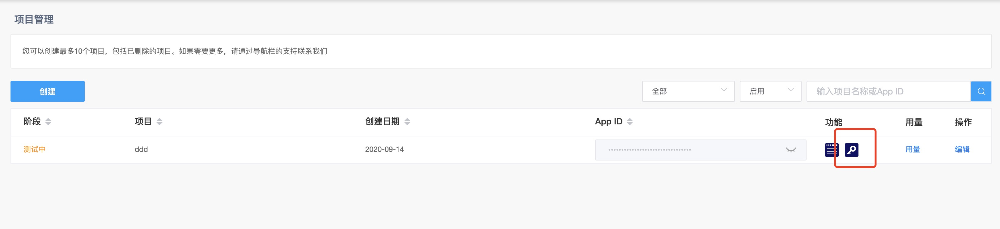

# Agora 声网 SDK 搭建 React/Typescript 简易视频互动通话应用

## 开发前准备

1. 首先需要创建一个 `Agora` 项目应用， 点击 <https://console.agora.io/> 该网址，按照步骤创建声网账号然后再创建项目即可，这一步不做过多解释

2. 创建好的项目可以在 当前控制台网页左侧 `菜单栏目` -> `项目管理`，中找到，点击如下图 红色标注位置

[](https://console.agora.io/projects)

3. 进入到音视频`临时Token`创建页面, 随便填写一个频道名称(channel)， 如 `demoChannel`, 生成临时 `TOKEN`, 复制 该页面的 `AppId`, `Token`, `Channel`, 这个会在后续的开发测试用的到

[](https://console.agora.io/projects)

## 搭建项目环境

我这里使用的是 `React`, `Typescript` 以及 `Antd` 技术栈

1. 创建项目

   ```
   npx create-react-app agora-demo --typescript
   ```

   这一步会为我们安装一个 `Typescript` 环境的 `React` 初始化项目

2. 安装必要依赖  
   主要需要安装 `Agora SDK`, 以及 `Antd` 等的
   ```bash
   $ yarn add  agora-rtc-sdk antd
   ```
   使用方式
   ```ts
   import AgoraRTC from 'agora-rtc-sdk';
   ```

> Tips: 坑点 1： 这里使用的 `Typescript` 开发环境，虽然 `Agora SDK` 官方表示可以支持 `Typescript`, 但是当直接引入的时候，`ts` 会报错,`Agora SDK`的 `index.d.ts` 不能当作模块使用，

> > 个人解决方案: 安装 `@types/agora-rtc-sdk`, 并配置 `tsconfig.json`, 的 `paths` 字段，将 `agora-rtc-sdk` 映射到类型模块里, 会发现报错已经消失了

```json
{
  "compilerOptions": {
    "baseUrl": "./",
    "paths": {
      "agora-rtc-sdk": ["node_modules/@types/agora-rtc-sdk"]
    }
  }
}
```

> Tips: 坑点 2：`react-script` 的 `typescript` 模式，会检查 `paths` 字段，不允许我们设置，启动项目后会强制修改 `tsconfig.json`， 天坑。。。

> > 个人解决方案：`react-script`其实是纯文本检查， 使用 `tsconfig.json` 的 `extends`字段，将上面的 配置 摘出来 存到 `paths.json`中，然后通过`extends`字段继承过来即可

```json
{
  "extends": "./paths.json"
}
```

3. 处理 `antd` 的相关配置 参考 [antd 官网](https://ant.design/docs/react/use-with-create-react-app-cn) 即可

## 常规代码实现

我这里参考的 官方案例实现的一套

```ts
// AgoraRTC.tsx
// 主要将 rtc 常用的 api 封装，回调函数 API 改成 Promise ，方便后续代码编写

import AgoraRTC, { Client, Stream } from 'agora-rtc-sdk';
import { IAudioDeviceInfo, IVideoDeviceInfo } from './types';

interface IDeviceInfoItem {
  name: string;
  value: string;
  kind: string;
}

interface IAudioDeviceInfo extends IDeviceInfoItem {}
interface IVideoDeviceInfo extends IDeviceInfoItem {}

interface IInitOptions {
  appId: string;
  channel: string;
  token: string;
  uid?: number;
}

export const isCarmeraKind = (kind: string) => kind === 'videoinput';

export const getDevices = (): Promise<[
  IAudioDeviceInfo[],
  IVideoDeviceInfo[],
]> => {
  return new Promise(resolve => {
    AgoraRTC.getDevices(devices => {
      const result = devices.reduce(
        (prev, cur) => {
          const kindIndex = ['audioinput', 'videoinput'].indexOf(cur.kind);
          if (kindIndex !== -1) {
            const defaultKindName = isCarmeraKind(cur.kind)
              ? `camera-${prev[kindIndex].length}`
              : `microphone-${prev[kindIndex].length}`;
            prev[kindIndex].push({
              name: cur.label || defaultKindName,
              value: cur.deviceId,
              kind: cur.kind,
            });
          }
          return prev;
        },
        [[], []] as [IAudioDeviceInfo[], IVideoDeviceInfo[]],
      );

      resolve(result);
    });
  });
};

export const initRTCClient = (rtcClient: Client, options: IInitOptions) => {
  return new Promise((resolve, reject) => {
    rtcClient.init(
      options.appId,
      () => {
        resolve();
      },
      err => reject(err),
    );
  });
};

export const joinRTCClient = (
  rtcClient: Client,
  options: IInitOptions,
): Promise<string | number> => {
  return new Promise((resolve, reject) => {
    rtcClient.join(
      options.token || null,
      options.channel,
      options.uid || null,
      uid => {
        resolve(uid);
      },
      err => {
        reject(err);
      },
    );
  });
};

export const leaveRTCClient = (rtcClient: Client) => {
  return new Promise((resolve, reject) => {
    rtcClient.leave(
      () => {
        resolve();
      },
      err => {
        reject(err);
      },
    );
  });
};

export const initLocalStream = (localStream: Stream) => {
  return new Promise((resolve, reject) => {
    localStream.init(
      () => resolve(),
      err => reject(err),
    );
  });
};

export { AgoraRTC };
```

然后是主代码的编写

```ts
import React from 'react';
import AgoraRTC, { Client, Stream } from 'agora-rtc-sdk';
import { Select, Input, Radio, Button, message } from 'antd';
import {
  getDevices,
  initRTCClient,
  joinRTCClient,
  initLocalStream,
  leaveRTCClient,
} from './AgoraRTC';

interface IDeviceInfoItem {
  name: string;
  value: string;
  kind: string;
}

interface IAudioDeviceInfo extends IDeviceInfoItem {}
interface IVideoDeviceInfo extends IDeviceInfoItem {}

interface IResolutionsItem {
  name: string;
  value: string;
}

const { Option } = Select;

const resolutions: IResolutionsItem[] = [
  {
    name: 'default',
    value: 'default',
  },
  {
    name: '480p',
    value: '480p',
  },
  {
    name: '720p',
    value: '720p',
  },
  {
    name: '1080p',
    value: '1080p',
  },
];

interface IAgoraRTCPageState {
  videos: IVideoDeviceInfo[];
  audios: IAudioDeviceInfo[];
  joined: boolean;
  published: boolean;
  uid: string;
  appId: string;
  token: string;
  channel: string;
  mode: 'live' | 'rtc';
  codec: 'vp8' | 'h264';
  cameraId: string;
  microphoneId: string;
  resolution: string;
  rtcClient: Client | null;
  localStream: Stream | null;
  streamList: Stream[];
}

class AgoraRTCPage extends React.Component<{}, IAgoraRTCPageState> {
  constructor(props: any) {
    super(props);
    this.state = {
      videos: [],
      audios: [],
      joined: false,
      published: false,
      uid: '',
      appId: 'ce359a175e5d4f41917a422ced6446bc',
      token:
        '006ce359a175e5d4f41917a422ced6446bcIABHZXQlp/7Ur9JWF2WMTW1Ws/WTV7z7RigEpP2YUi+HnyMni+gAAAAAEAAzuiAFpmVlXwEAAQCmZWVf',
      channel: 'demoChannel',
      mode: 'live',
      codec: 'h264',
      cameraId: '',
      microphoneId: '',
      resolution: resolutions[0].value,
      rtcClient: null,
      localStream: null,
      streamList: [],
    };
  }

  componentDidMount() {
    (async () => {
      const [audios, videos] = await getDevices();
      const cameraId = videos.length > 0 ? videos[0].value : '';
      const microphoneId = audios.length > 0 ? audios[0].value : '';
      this.setState({
        audios,
        videos,
        cameraId,
        microphoneId,
      });
    })();
  }

  addStreamView(stream: Stream, cb?: () => void) {
    const { streamList } = this.state;
    if (streamList.every(item => item.getId() !== stream.getId())) {
      this.setState(
        {
          streamList: [...streamList, stream],
        },
        () => {
          this.state.streamList.forEach(stream => {
            if (!stream.isPlaying()) {
              stream.play(`${stream.getId()}`);
            }
          });
          cb && cb();
        },
      );
    }
  }

  removeStreamView(stream: Stream) {
    const { streamList } = this.state;
    const uid = stream.getId();
    if (stream.isPlaying()) {
      stream.stop();
    }

    stream.close();

    this.setState({
      streamList: streamList.filter(item => item.getId() !== uid),
    });
  }

  clearStreamView() {
    const { streamList } = this.state;
    streamList.forEach(stream => {
      if (stream.isPlaying()) {
        stream.stop();
      }
      stream.close();
    });
    this.setState({ streamList: [] });
  }

  handleJoin = async () => {
    const {
      appId,
      channel,
      codec,
      joined,
      token,
      mode,
      cameraId,
      microphoneId,
    } = this.state;

    if (joined) return message.info('已经加入了');
    if (!appId || !token || !channel) return message.info('信息不完整');

    const rtcClient = AgoraRTC.createClient({ mode, codec });
    this.bindRTCClientEvents(rtcClient);

    const options = {
      appId,
      token,
      channel,
    };

    try {
      await initRTCClient(rtcClient, options);
      const uid = await joinRTCClient(rtcClient, options);
      const localStream = AgoraRTC.createStream({
        streamID: uid,
        audio: true,
        video: true,
        screen: false,
        microphoneId: microphoneId,
        cameraId: cameraId,
      });

      await initLocalStream(localStream);

      console.log('执行到了');
      this.addStreamView(localStream, () => {
        if (this.state.published) return;
        rtcClient.publish(localStream, err => {
          this.setState({ published: false, joined: false });
          console.error(err);
          message.error('publish failed');
        });
        this.setState({ published: true });
      });

      this.setState({
        uid: `${uid}`,
        rtcClient,
        localStream,
        joined: true,
      });
    } catch (error) {
      message.error('Join Failed');
      console.error(error);
    }
  };

  handleLeave = async () => {
    const { localStream, rtcClient, joined } = this.state;
    if (!localStream || !rtcClient) return message.error('Please Join First!');
    if (!joined) return message.error('You are not in channel');
    try {
      await leaveRTCClient(rtcClient);
      this.clearStreamView();
      this.setState({
        rtcClient: null,
        localStream: null,
        published: false,
        joined: false,
      });
      message.success('leave success');
    } catch (error) {
      message.error('leave failed');
      console.error(error);
    }
  };

  handlePublish = () => {
    const { rtcClient, localStream, published } = this.state;
    if (!rtcClient || !localStream)
      return message.error('Please Join Room First');
    if (published) return message.error('You already published');

    rtcClient.publish(localStream, err => {
      this.setState({
        published: false,
      });
      console.error(err);
      message.error('publish failed');
    });
    this.setState({ published: true });
    message.info('publish success');
  };

  handleUnPublish = () => {
    const { rtcClient, localStream, published } = this.state;
    if (!rtcClient || !localStream)
      return message.error('Please Join Room First');
    if (!published) return message.error("You did'nt publish");
    rtcClient.unpublish(localStream, err => {
      this.setState({ published: true });
      console.error(err);
      message.error('unpublish failed');
    });
    this.setState({ published: false });
    message.info('unpublish success');
  };

  bindRTCClientEvents = (rtcClient: Client) => {
    if (!rtcClient) return message.error('Please Join Room First');
    // Occurs when an error message is reported and requires error handling.
    rtcClient.on('error', err => {
      console.log(err);
      message.info('error');
    });

    // Occurs when the peer user leaves the channel; for example, the peer user calls Client.leave.
    rtcClient.on('peer-leave', evt => {
      const id = evt.uid;
      const { streamList } = this.state;
      message.info(`peer leave remote-uid: ${id}`);
      const stream = streamList.find(stream => stream.getId() === Number(id));
      if (!stream) return;
      this.removeStreamView(stream);
      console.log('peer-leave', id);
    });

    // Occurs when the local stream is published.
    rtcClient.on('stream-published', evt => {
      console.log('stream-published');
      message.info('stream-published');
    });

    rtcClient.on('stream-added', evt => {
      const { uid } = this.state;
      const remoteStream = evt.stream;
      const id = remoteStream.getId();
      if (id !== uid && rtcClient) {
        message.info('stream-added remote-uid: ' + id);
        console.log('stream-added remote-uid: ', id);

        rtcClient.subscribe(
          remoteStream,
          {
            video: true,
            audio: true,
          },
          err => {
            console.log('stream subscribe failed', err);
          },
        );
      }
    });

    // Occurs when a user subscribes to a remote stream.
    rtcClient.on('stream-subscribed', evt => {
      const remoteStream = evt.stream;
      const id = remoteStream.getId();
      this.addStreamView(remoteStream);
      message.info('stream-subscribed remote-uid: ' + id);
      console.log('stream-subscribed remote-uid: ', id);
    });

    // Occurs when the remote stream is removed; for example, a peer user calls Client.unpublish.
    rtcClient.on('stream-removed', evt => {
      const remoteStream = evt.stream;
      const id = remoteStream.getId();
      this.removeStreamView(remoteStream);
      message.info('stream-removed uid: ' + id);
      console.log('stream-removed remote-uid: ', id);
    });

    /* Token 过期 */
    rtcClient.on('onTokenPrivilegeWillExpire', function() {
      // After requesting a new token
      // rtc.client.renewToken(token);
      message.info('onTokenPrivilegeWillExpire');
      console.log('onTokenPrivilegeWillExpire');
    });

    rtcClient.on('onTokenPrivilegeDidExpire', function() {
      // After requesting a new token
      // client.renewToken(token);
      message.info('onTokenPrivilegeDidExpire');
      console.log('onTokenPrivilegeDidExpire');
    });
  };

  render() {
    const {
      streamList,
      appId,
      channel,
      mode,
      codec,
      token,
      joined,
      published,
      rtcClient,
      localStream,
      videos,
      audios,
      cameraId,
      microphoneId,
      resolution,
      uid,
    } = this.state;

    return (
      <>
        <div className="top--content">
          <div className="title">视频区</div>
          {streamList.map(stream => (
            <div
              id={`${stream.getId()}`}
              className="video--box"
              key={stream.getId()}
            ></div>
          ))}
        </div>
        <div className="bottom--content">
          <div className="title">配置区</div>
          <div className="config__panel--container">
            <div className="config__panel--title">基础设置</div>
            <div className="config--label">APPID</div>
            <Input
              className="config--item"
              placeholder="APPID"
              value={appId}
              onChange={e => this.setState({ appId: e.target.value })}
            />
            <div className="config--label">CHANNEL</div>
            <Input
              className="config--item"
              placeholder="CHANNEL"
              value={channel}
              onChange={e => this.setState({ channel: e.target.value })}
            />
            <div className="config--label">TOKEN</div>
            <Input
              className="config--item"
              placeholder="TOKEN"
              value={token}
              onChange={e => this.setState({ token: e.target.value })}
            />
            <div className="config__btn--list">
              <Button
                className="config--btn"
                disabled={!!joined}
                type="primary"
                onClick={this.handleJoin}
              >
                Join
              </Button>
              <Button
                className="config--btn"
                disabled={!joined}
                type="primary"
                onClick={this.handleLeave}
              >
                Leave
              </Button>
              <Button
                className="config--btn"
                disabled={!joined || !rtcClient || !localStream || published}
                type="primary"
                onClick={this.handlePublish}
              >
                Publish
              </Button>
              <Button
                className="config--btn"
                disabled={!joined || !rtcClient || !localStream || !published}
                type="primary"
                onClick={this.handleUnPublish}
              >
                Unpublish
              </Button>
            </div>
          </div>
          <div className="config__panel--container">
            <div className="config__panel--title">高级设置</div>
            <div className="config--label">UID</div>
            <Input
              className="config--item"
              placeholder="UID"
              readOnly
              value={uid}
            />
            <div className="config--label">CAMERA</div>
            <Select
              className="config--item"
              value={cameraId}
              onChange={value => this.setState({ cameraId: value })}
            >
              {videos.map((device, index) => (
                <Option key={index} value={device.value}>
                  {device.name}
                </Option>
              ))}
            </Select>
            <div className="config--label">MICROPHONE</div>
            <Select
              className="config--item"
              value={microphoneId}
              onChange={value => this.setState({ microphoneId: value })}
            >
              {audios.map((device, index) => (
                <Option key={index} value={device.value}>
                  {device.name}
                </Option>
              ))}
            </Select>

            <div className="config--label">CAMERA RESOLUTION</div>
            <Select
              className="config--item"
              value={resolution}
              onChange={value => this.setState({ resolution: value })}
            >
              {resolutions.map((item, index) => (
                <Option key={index} value={item.value}>
                  {item.name}
                </Option>
              ))}
            </Select>

            <div className="config--label">MODE</div>
            <Radio.Group
              className="config--label"
              value={mode}
              onChange={e => this.setState({ mode: e.target.value })}
            >
              <Radio value="live">live</Radio>
              <Radio value="rtc">rtc</Radio>
            </Radio.Group>

            <div className="config--label">CODEC</div>
            <Radio.Group
              className="config--label"
              value={codec}
              onChange={e => this.setState({ codec: e.target.value })}
            >
              <Radio value="h264">h264</Radio>
              <Radio value="vp8">vp8</Radio>
            </Radio.Group>
          </div>
        </div>
      </>
    );
  }
}

export default AgoraRTCPage;
```

## 总结

代码已经上传到 github， <https://github.com/JohnApache/agora-demo>，该用例主要为了体验下使用 agora sdk 配合 react 开发视频通话应用，如果有什么建议错误，欢迎指正
