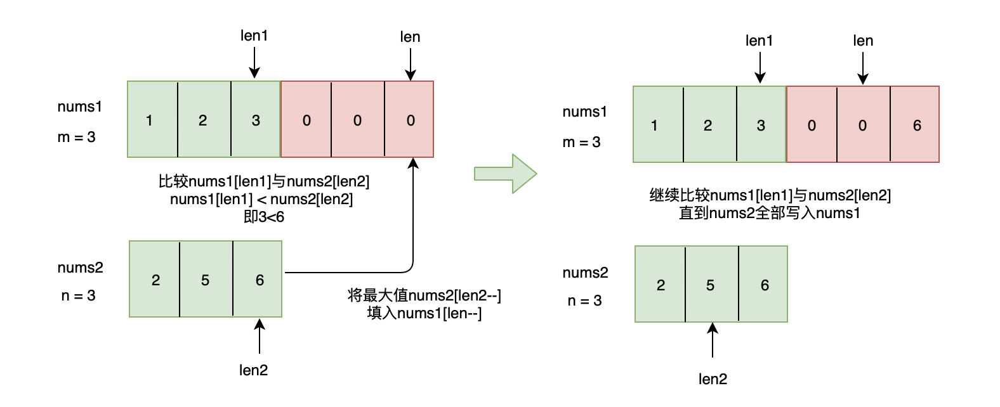

# 合并两个有序数组

## 题目链接

<https://leetcode-cn.com/problems/merge-sorted-array/solution/tu-jie-he-bing-liang-ge-you-xu-shu-zu-by-user7746o/>

## 问题描述

> 给你两个`有序整数数组` nums1 和 nums2，请你将 nums2 合并到 nums1 中，使 num1 成为一个`有序数组`。

> 说明: 初始化 nums1 和 nums2 的元素数量分别为 m 和 n 。
> 你可以假设 nums1 有足够的空间（**`空间大小大于或等于 m + n`**）来保存 nums2 中的元素。

## 示例

```js
// 输入:
(nums1 = [1, 2, 3, 0, 0, 0]), (m = 3);
(nums2 = [2, 5, 6]), (n = 3);

// 输出: [1,2,2,3,5,6]
```

## 个人答案

### 差解

比较粗暴的写法可以实现效果，但是时间复杂度很高

```ts
const fn = () =>
  nums1
    .slice(0, m)
    .concat(nums2.slice(0, n))
    .sort((i, j) => i - j);

console.log(fn());

// 输出: [1,2,2,3,5,6]
```

### 优解



`nums1` 、 `nums2` 有序，若把 `nums2` 全部合并到 `nums1` ，则合并后的 nums1 长度为 m+n

我们可以从下标 `m+n-1` 的位置填充 `nums1` ，比较 `nums1[len1]` 与 `nums2[len2]` 的大小，将最大值写入 `nums1[len]`，即
`nums1[len1]>=nums2[len2]` ，`nums1[len--] = nums1[len1--]` ,这里 `--` 是因为写入成功后，下标自动建议，继续往前比较
否则 `nums1[len--]` = `nums2[len2--]`

边界条件：

若 `len1 < 0` ，即 `len2 >= 0` ，此时 `nums1` 已重写入， `nums2` 还未合并完，仅仅需要将 `nums2` 的剩余元素（0…len）写入 `nums2` 即可，写入后，合并完成
若 `len2 < 0`，此时 `nums2` 已全部合并到 `nums1` ，合并完成

```ts
const fn = () => {
  const nums1 = [1, 2, 3, 0, 0, 0];
  const m = 3;
  const nums2 = [2, 5, 6];
  const n = 3;

  let len1 = m - 1;
  let len2 = n - 1;
  let len = m + n - 1;
  while (len2 >= 0) {
    if (len1 < 0) {
      nums1[len--] = nums2[len2--];
      continue;
    }
    if (nums1[len1] > nums2[len2]) {
      nums1[len--] = nums1[len1--];
    } else {
      nums1[len--] = nums2[len2--];
    }
  }
  return nums1;
};
console.log(fn());
// 输出: [1,2,2,3,5,6]
```
