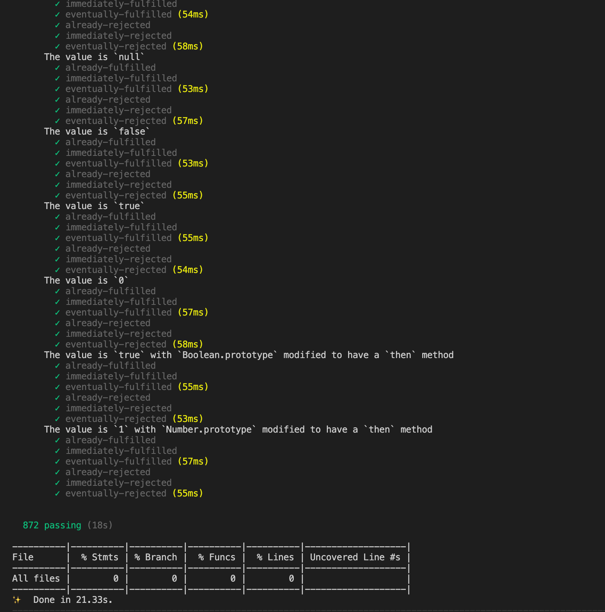

# Typescript 实现一个符合 Promise/A+ 规范

## 前期准备

1. 需要先下载 `promises-aplus-tests`  测试 `Promise/A+` 规范套件

   ```bash
   $ yarn add promises-aplus-tests -D
   $ npm install promises-aplus-tests --dev
   ```

2. 使用本地 `mocha` 配合 `promises-aplus-tests` 运行测试套件

   - 需要先添加一个测试入口 `adapater` 适配器

     ```ts
     import PromisesAplusTests from 'promises-aplus-tests';

     // 这个是 实现的 Promise/A+ 代码
     import MyPromise from '../src/Promise';

     const MyPromise = require('../src/Promise.js');
     MyPromise.defer = MyPromise.deferred = function() {
       const result: any = {};
       result.promise = new MyPromise((resolve: any, reject: any) => {
         result.resolve = resolve;
         result.reject = reject;
       });
       return result;
     };

     // mocha 运行 promises-aplus-tests 测试用例
     describe('Promises/A+ Tests', function() {
       PromisesAplusTests.mocha(MyPromise);
     });
     ```

   - 添加测试命令脚本
     ```json
     {
       "scripts": {
         "test:mocha": "nyc --reporter=text mocha --require ts-node/register 'test/**/*.{ts,tsx}' -t 5000"
       }
     }
     ```

   > Tips：如果不存在本地的 `mocha` 测试环境，也可以在 `package.scripts` 脚本中直接使用 `promises-aplus-tests test/adapater.js` 运行测试套件, (我这里使用 `mocha` 是为了方便 `ts` 环境测试)

- 运行测试套件
  ```bash
  $ yarn test:mocha # 或者
  $ npm run test:mocha
  ```

## 编写 Promise/A+ 代码 须知

1. **Promise 初始化函数是同步执行的**

   ```ts
   type TResolveFn = (value?: any) => void;
   type TRejectFn = (reason?: any) => void;
   type TPromiseExecutor = (resolve: TResolveFn, reject: TRejectFn) => void;
   class MyPromise {
     public callbacks: ICallback[] = [];

     constructor(executor: TPromiseExecutor) {
       const resolve = (value: any) => {};
       const reject = (reason: any) => {};
       try {
         executor(resolve, reject);
       } catch (error) {
         reject(error);
       }
     }
   }
   ```

2. **Promise 状态**

   - `Promise` 有 3 个状态，分别是 `pending`, `fulfilled` 和 `rejected`
   - 在 `pending` 状态，`Promise` 可以切换到 `fulfilled` 或 `rejected` 状态
   - 在 `fulfilled` 或者 `rejected` 状态，都不能迁移到其它状态，必须有个不可变的 `result`

   ```ts
   enum STATE {
     PENDING = 'pending',
     FULFILLED = 'fulfilled',
     REJECTED = 'rejected',
   }

   class MyPromise {
     public state: STATE = STATE.PENDING;

     private _transition(state: STATE, result: any) {
       if (this.state !== STATE.PENDING) return;
       this.state = state;
       this.result = result;
     }
   }
   ```


    ```

3. **Promise Thenable**

   - `Promise` 实例必须包含一个 `then` 方法
   - `then` 方法可以接受两个可选参数，`onFulfilled`, `onRejected` , `onFulfilled` 和 `onRejected` 如果是函数，必须最多执行一次。
   - `then` 方法可以被调用很多次，每次注册一组 `onFulfilled` 和 `onRejected` 的 `callback`。它们如果被调用，必须按照注册顺序调用。
   - `then` 方法必须返回一个`Promise`

   ```ts
   type TFulfilledFn = (data?: any) => any;
   type TRejectedFn = (err?: any) => any;
   type TResolveFn = (value?: any) => void;
   type TRejectFn = (reason?: any) => void;

   interface ICallback {
     resolve: TResolveFn;
     reject: TRejectFn;
     onFulfilled?: TFulfilledFn;
     onRejected?: TRejectedFn;
   }

   class MyPromise {
     public callbacks: ICallback[] = [];

     public then(onFulfilled?: TFulfilledFn, onRejected?: TRejectedFn) {
       return new MyPromise((resolve, reject) => {
         const callback: ICallback = {
           onFulfilled,
           onRejected,
           resolve,
           reject,
         };
         if (this.state === STATE.PENDING) {
           this.callbacks.push(callback);
           return;
         }
         setTimeout(this._handleCallback.bind(this, callback), 0);
       });
     }
   }
   ```

   > Tips: `_handleCallback` 需要套在`setTimeout`下运行，因为 `then`方法有一个很重要的约束 `onFulfilled or onRejected must not be called until the execution context stack contains only platform code.`  
   > 我们不是在 JS 引擎层面实现 Promises，而是使用 JS 去实现 JS Promises。在 JS 里无法主动控制自身 `execution context stack`。可以通过 `setTimeout/nextTick` 等 API 间接实现，此处选用了 `setTimeout`。

4. **handleCallback 在不同情况下的处理**

   - 根据 `state` 状态，判断是走 `fulfilled` 路径，还是 `rejected` 路径。
   - 判断 `onFulfilled`/`onRejected` 是否为函数，如果是以函数的返回值，作为下一个 `Promise` 的 `result`, 如果不是，则直接已当前 `result` 作为下个 `Promise` 的 `result`
   - 如果 `onFulfilled`/`onRejected` 执行过程中抛错，那这个错误，作为下一个 `Promise` 的 `rejected reason` 来用。

   ```ts
   const isFunction = (value: any): value is Function =>
     typeof value === 'function';
   class MyPromise {
     private _handleCallback(callback: ICallback) {
       const { onFulfilled, onRejected, resolve, reject } = callback;

       try {
         if (this.state === STATE.FULFILLED) {
           isFunction(onFulfilled)
             ? resolve(onFulfilled(this.result))
             : resolve(this.result);
           return;
         }
         if (this.state === STATE.REJECTED) {
           isFunction(onRejected)
             ? resolve(onRejected(this.result))
             : reject(this.result);
         }
       } catch (error) {
         reject(error);
       }
     }
   }
   ```

5. **Resolve 在不同情况下的处理**

   - 当 `resolve` 自己本身这个 `Promise` 时, 直接抛出 `TypeError` 异常
   - 如果 `resolve` 对象是另外一个 `Promise`对象时，沿用该 `Promise` 的 `state` 和 `result` 往下面传递
   - 如果 `resolve` 对象时 `Thenable` 对象时，即类似 `Promise` 对象，可以先取出 对应的 `then` 函数，封装为新的 `Promise` 对象，然后继续传递下去
   - 如果不是上述情况，这个 `result` 成为当前 `Promise` 的 `result`

   ```ts
   const isFunction = (value: any): value is Function =>
     typeof value === 'function';

   const isObject = (value: any): value is Object =>
     Object.prototype.toString.call(value) === '[object Object]';

   /* eslint-disable */
   const isMyPromise = (value: any): value is MyPromise =>
     value instanceof MyPromise;
   /* eslint-enable */

   const isThenable = (thenable: any): boolean =>
     (isFunction(thenable) || isObject(thenable)) && 'then' in thenable;

   class MyPromise {
     private _resolvePromise(
       value: any,
       onFullfilled: TFulfilledFn,
       onRejected: TRejectedFn,
     ) {
       if (value === this) {
         return onRejected(
           new TypeError('Can not fulfill promise with itself'),
         );
       }
       if (isMyPromise(value)) {
         return value.then(onFullfilled, onRejected);
       }
       if (isThenable(value)) {
         try {
           const then = value.then;
           if (isFunction(then)) {
             return new MyPromise(then.bind(value)).then(
               onFullfilled,
               onRejected,
             );
           }
         } catch (error) {
           return onRejected(error);
         }
       }
       onFullfilled(value);
     }
   }
   ```

6. **整理剩余细节代码**

   - `resolve` 和 `reject` 只能执行一次
   - 初始化函数跑出的异常会被直接作为`reject` 的 `reason` 来用。
   - 当状态变更时，异步执行所有 `callbacks` 并清空列表

   ```ts
   enum STATE {
     PENDING = 'pending',
     FULFILLED = 'fulfilled',
     REJECTED = 'rejected',
   }
   class MyPromise {
     public state: STATE = STATE.PENDING;
     public result: any;
     public callbacks: ICallback[] = [];

     constructor(executor: TPromiseExecutor) {
       const onFulfilled = (value: any) =>
         this._transition(STATE.FULFILLED, value);
       const onRejected = (reason: any) =>
         this._transition(STATE.REJECTED, reason);

       let ignore: boolean = false;
       const resolve = (value: any) => {
         if (ignore) return;
         ignore = true;
         this._resolvePromise(value, onFulfilled, onRejected);
       };

       const reject = (reason: any) => {
         if (ignore) return;
         ignore = true;
         onRejected(reason);
       };

       try {
         executor(resolve, reject);
       } catch (error) {
         reject(error);
       }
     }

     private _transition(state: STATE, result: any) {
       if (this.state !== STATE.PENDING) return;
       this.state = state;
       this.result = result;
       setTimeout(this._handleAllCallbacks.bind(this), 0);
     }

     private _handleAllCallbacks() {
       this.callbacks.forEach(callback => this._handleCallback(callback));
       this.callbacks = [];
     }
   }
   ```

## 总结

综上所述，附上完整代码和 [github 地址](https://github.com/JohnApache/promise-aplus-impl)

```ts
// Promise 状态
enum STATE {
  PENDING = 'pending',
  FULFILLED = 'fulfilled',
  REJECTED = 'rejected',
}

type TResolveFn = (value?: any) => void;
type TRejectFn = (reason?: any) => void;
type TFulfilledFn = (data?: any) => any;
type TRejectedFn = (err?: any) => any;
type TPromiseExecutor = (resolve: TResolveFn, reject: TRejectFn) => void;

interface ICallback {
  resolve: TResolveFn;
  reject: TRejectFn;
  onFulfilled?: TFulfilledFn;
  onRejected?: TRejectedFn;
}

const isFunction = (value: any): value is Function =>
  typeof value === 'function';

const isObject = (value: any): value is Object =>
  Object.prototype.toString.call(value) === '[object Object]';

/* eslint-disable */
const isMyPromise = (value: any): value is MyPromise =>
  value instanceof MyPromise;
/* eslint-enable */

const isThenable = (thenable: any): boolean =>
  (isFunction(thenable) || isObject(thenable)) && 'then' in thenable;

class MyPromise {
  public state: STATE = STATE.PENDING;
  public result: any;
  public callbacks: ICallback[] = [];

  constructor(executor: TPromiseExecutor) {
    const onFulfilled = (value: any) =>
      this._transition(STATE.FULFILLED, value);
    const onRejected = (reason: any) =>
      this._transition(STATE.REJECTED, reason);

    // Promise状态只能迁移一次
    let ignore: boolean = false;
    const resolve = (value: any) => {
      if (ignore) return;
      ignore = true;
      this._resolvePromise(value, onFulfilled, onRejected);
    };

    const reject = (reason: any) => {
      if (ignore) return;
      ignore = true;
      onRejected(reason);
    };

    try {
      executor(resolve, reject);
    } catch (error) {
      // 初始化函数抛出异常会被作为 reject reason
      reject(error);
    }
  }

  public then(onFulfilled?: TFulfilledFn, onRejected?: TRejectedFn) {
    return new MyPromise((resolve, reject) => {
      const callback: ICallback = {
        onFulfilled,
        onRejected,
        resolve,
        reject,
      };
      if (this.state === STATE.PENDING) {
        this.callbacks.push(callback);
        return;
      }
      setTimeout(this._handleCallback.bind(this, callback), 0);
    });
  }

  // catch 本质上就是 then 函数不接收 onFulfilled 函数的返回结果
  public catch(onRejected?: TRejectedFn) {
    return this.then(undefined, onRejected);
  }

  private _transition(state: STATE, result: any) {
    if (this.state !== STATE.PENDING) return;
    this.state = state;
    this.result = result;
    // 异步执行所有回调函数
    setTimeout(this._handleAllCallbacks.bind(this), 0);
  }

  private _handleCallback(callback: ICallback) {
    const { onFulfilled, onRejected, resolve, reject } = callback;

    try {
      if (this.state === STATE.FULFILLED) {
        // 如果是函数，将当前result 作为参数。传递给该函数，并使用函数的执行结果作为当前result，传递给下一个 Promise
        // 如果不是函数 则直接使用 当前result 传递给下一个 Promise
        isFunction(onFulfilled)
          ? resolve(onFulfilled(this.result))
          : resolve(this.result);
        return;
      }
      if (this.state === STATE.REJECTED) {
        isFunction(onRejected)
          ? resolve(onRejected(this.result))
          : reject(this.result);
      }
    } catch (error) {
      reject(error);
    }
  }

  private _handleAllCallbacks() {
    // 执行所有的回调并清空
    this.callbacks.forEach(callback => this._handleCallback(callback));
    this.callbacks = [];
  }

  private _resolvePromise(
    value: any,
    onFullfilled: TFulfilledFn,
    onRejected: TRejectedFn,
  ) {
    if (value === this) {
      return onRejected(new TypeError('Can not fulfill promise with itself'));
    }
    if (isMyPromise(value)) {
      return value.then(onFullfilled, onRejected);
    }
    if (isThenable(value)) {
      try {
        const then = value.then;
        if (isFunction(then)) {
          return new MyPromise(then.bind(value)).then(onFullfilled, onRejected);
        }
      } catch (error) {
        return onRejected(error);
      }
    }
    onFullfilled(value);
  }

  // 兼容测试用例
  public static defer: any;
  public static deferred: any;

  public static resolve(value?: any) {
    return new MyPromise(resolve => resolve(value));
  }

  public static reject(reason?: any) {
    return new MyPromise((_, reject) => reject(reason));
  }

  public static all(...promises: MyPromise[]) {
    return new MyPromise((resolve, reject) => {
      const len = promises.length;
      const values: any[] = new Array(len);
      let count = 0;
      promises.forEach((prom, i) => {
        prom.then(value => {
          values[i] = value;
          count++;
          if (count === len) {
            resolve(values);
          }
        }, reject);
      });
    });
  }

  public static race(...promises: MyPromise[]) {
    return new MyPromise((resolve, reject) => {
      promises.forEach(prom => {
        prom.then(resolve, reject);
      });
    });
  }
}

export default MyPromise;
```

最后放一下 `promises-aplus-tests` 测试结果截图
[](https://github.com/JohnApache/promise-aplus-impl/actions)
