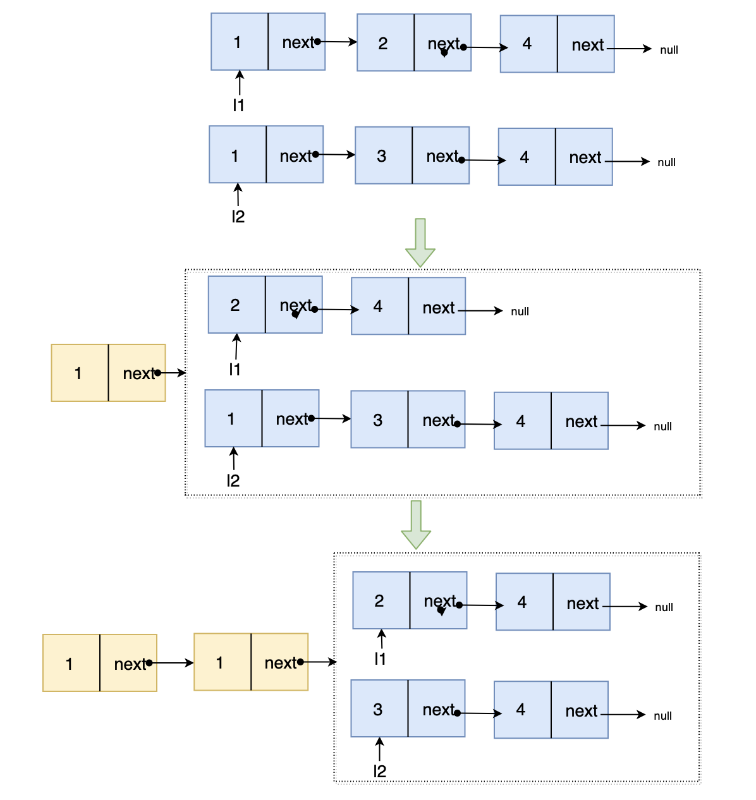

---
group:
  title: 链表 相关面试题
  order: 1
---

# 合并两个有序链表

## 题目链接

<https://leetcode-cn.com/problems/merge-two-sorted-lists/>

## 题目描述

将两个升序链表合并为一个新的 升序 链表并返回。新链表是通过拼接给定的两个链表的所有节点组成的。

## 示例：

```js
// 输入：
l1 = [1,2,4], l2 = [1,3,4]
// 输出：
[1,1,2,3,4,4]


// 输入：
l1 = [], l2 = []
// 输出：
[]

// 输入：
l1 = [], l2 = [0]
// 输出：
[0]
```

## 个人答案

### 错解

这个题目一开始我理解错题目的含义，写出来的方案是实现使用了双向链表去做合并功能，而且扩展了双向链表的功能，才实现的，虽然不是题目想要的方案，但是原理使用了和`合并两个有序数组`同原理的方案，其实也拿出来作为一个参考

```ts
class Node {
  public next: Node | undefined;
  public prev: Node | undefined;
  constructor(public element: number) {}
}

// 实现一个双向链表，并扩展了其中的功能
class DoubleLinkedList {
  public head: Node | undefined;
  public tail: Node | undefined;
  public length: number = 0;

  getList() {
    const result: number[] = [];
    let next = this.head;
    while (next) {
      result.push(next.element);
      next = next.next;
    }
    return result;
  }

  append(element: number) {
    const node = new Node(element);
    this.length++;
    if (!this.head || !this.tail) {
      this.head = node;
      this.tail = node;
      return;
    }
    this.tail.next = node;
    node.prev = this.tail;
    this.tail = node;
  }

  insertBefore(beforNode: Node, element: number) {
    const node = new Node(element);
    const prevBeforeNode = beforNode.prev;
    this.length++;
    if (!prevBeforeNode) {
      // 插入的是head位置之前
      node.next = beforNode;
      beforNode.prev = node;
      this.head = node;
      return;
    }
    prevBeforeNode.next = node;
    node.prev = prevBeforeNode;
    node.next = beforNode;
    beforNode.prev = node;
  }

  insertAfter(afterNode: Node, element: number) {
    const nextAfterNode = afterNode.next;
    if (!nextAfterNode) {
      // 插入tail;
      this.append(element);
      return;
    }
    this.insertBefore(nextAfterNode, element);
  }
}

const s1 = new DoubleLinkedList();
const s2 = new DoubleLinkedList();
s1.append(1);
s1.append(2);
s1.append(4);
s1.append(6);
s1.append(8);
console.log(s1.getList().join('->'));

s2.append(1);
s2.append(3);
s2.append(4);
s2.append(7);
s2.append(9);
console.log(s2.getList().join('->'));

//输出
// 1->2->4->6->8
// 1->3->4->7->9

// 合并两个 有序 双向链表
const concatTwoDoubleSortedLinkedList = (
  sortedLinkedList1: DoubleLinkedList,
  sortedLinkedList2: DoubleLinkedList,
) => {
  let s1 = sortedLinkedList1.tail;
  let s2 = sortedLinkedList2.tail;
  if (!sortedLinkedList2.head) return sortedLinkedList1;
  while (s1) {
    if (!s2) return sortedLinkedList1;

    // s1最大的节点小于等于s2最大节点,直接追加到s1，s2向前偏移
    if (s1.element <= s2.element) {
      sortedLinkedList1.insertAfter(s1, s2.element);
      s2 = s2.prev;
      continue;
    }

    // s1 向前偏移
    s1 = s1.prev;
  }

  // s1遍历完成后， s2剩余的元素都是小于s1的 ，直接依次插入即可
  while (s2) {
    if (!sortedLinkedList1.head) {
      sortedLinkedList1.append(s2.element);
    } else {
      sortedLinkedList1.insertBefore(sortedLinkedList1.head, s2.element);
    }
    s2 = s2.prev;
  }
  return sortedLinkedList1;
};

console.log(concatTwoDoubleSortedLinkedList(s1, s2).getList());
// 输出
// [
//   1, 1, 2, 3, 4,
//   4, 6, 7, 8, 9
// ]
```

### 正解

本题目实际考察的是 两个有序单向链表结构的合并， 这里使用了`递归`的方式实现了效果,

解题思路： 从链表头开始比较，`l1` 与 `l2` 是有序递增的，所以比较 `l1.val` 与 `l2.val` 的较小值就是合并后链表的最小值，次小值就是小节点的 `next.val` 与大节点的 `val` 比较的较小值，依次递归，直到递归到 `l1` `l2` 均为 `null`

图解如下


```ts
class Node {
  public next: Node | undefined;
  constructor(public element: number) {}
}
//   实现了一个单向链表
class SingleLinkedList {
  public head: Node | undefined;
  getList() {
    const result: number[] = [];
    let next = this.head;
    while (next) {
      result.push(next.element);
      next = next.next;
    }
    return result;
  }

  append(element: number) {
    const node = new Node(element);
    if (!this.head) {
      this.head = node;
      return;
    }
    let next = this.head;
    while (next) {
      const nextNext = next.next;
      if (!nextNext) {
        next.next = node;
        return;
      }
      next = nextNext;
    }
  }
}

const s3 = new SingleLinkedList();
const s4 = new SingleLinkedList();
s3.append(1);
s3.append(2);
s3.append(4);
s3.append(6);
s3.append(8);
console.log(s3.getList().join('->'));

s4.append(1);
s4.append(3);
s4.append(4);
s4.append(7);
s4.append(9);
console.log(s4.getList().join('->'));

// 输出
// 1->2->4->6->8
// 1->3->4->7->9

// 实现两个单向链表的合并
const concatTwoSingleLinkedList = (
  s1: Node | undefined,
  s2: Node | undefined,
): Node | undefined => {
  if (!s1) return s2;
  if (!s2) return s1;
  if (s1.element <= s2.element) {
    s1.next = concatTwoSingleLinkedList(s1.next, s2);
    return s1;
  }
  s2.next = concatTwoSingleLinkedList(s2.next, s1);
  return s2;
};

concatTwoSingleLinkedList(s3.head, s4.head);

console.log(s3.getList());
// 输出
// [
//   1, 1, 2, 3, 4,
// ]
```
